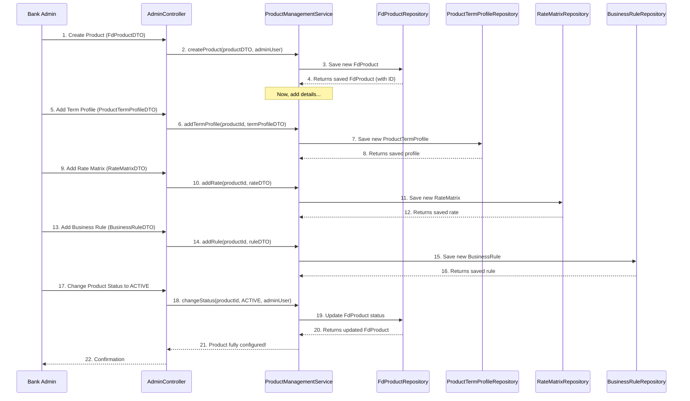

# Chapter 1: FD Product Catalog

Welcome to the CashCached project tutorial! In this first chapter, we're going to explore a fundamental concept: the **FD Product Catalog**.

Imagine a bank that offers various types of Fixed Deposits (FDs). Some might be "Standard FDs," others "Senior Citizen FDs," and some could be "Premium FDs" with special benefits. Each of these isn't just a name; they come with their own specific rules:
*   How much money can you put in (minimum/maximum amount)?
*   How long can you keep the money in the FD (minimum/maximum tenure)?
*   What interest rate will you earn? (This might even change based on the customer or how long they invest!)
*   Are there any special rules, like penalties for early withdrawal?

Managing all these different rules for each FD offering can get complicated quickly! This is precisely the problem the **FD Product Catalog** helps us solve.

## What is the FD Product Catalog?

Think of the FD Product Catalog as the bank's **digital brochure or menu** for all its Fixed Deposit schemes. It's not about a specific customer's FD; it's about defining *what types of FDs the bank makes available*.

This catalog acts as a blueprint. When a customer wants to open an FD, they pick one of these predefined products from the catalog, and the system automatically applies all the rules associated with that product.

### Our Central Use Case: Launching a New FD Product

Let's say the bank wants to introduce a brand new Fixed Deposit offering called "Green Growth FD." This new product needs to have its own unique set of rules:
*   It's for amounts between $5,000 and $100,000.
*   It has terms between 1 year and 5 years.
*   It offers a base interest rate of 4.5%.
*   Senior citizens get an extra 0.5% interest.
*   There's a 1% penalty for early withdrawal.

How do we define all these details in our `cashcached` system using the FD Product Catalog?

## Breaking Down the FD Product Catalog

To manage all these details, the "FD Product Catalog" concept isn't just one simple item. It's made up of several interconnected parts, like different sections in a comprehensive bank brochure:

| Catalog Component        | What it Defines                                       | Analogy                                   |
| :----------------------- | :---------------------------------------------------- | :---------------------------------------- |
| **FD Product**           | The core identity of an FD offering (name, description, overall min/max, base rate). | The main heading of an FD scheme in a brochure. |
| **Product Term Profile** | Specific amount/term ranges for a product, and how interest is calculated (compounding). | Specific duration options (e.g., "1-year FD," "3-year FD"). |
| **Rate Matrix**          | How interest rates vary based on customer type (e.g., Senior Citizen, Retail) and exact term. | A table showing different rates for different customers/terms. |
| **Business Rules**       | Any special conditions, like penalties or eligibility. | Fine print or special conditions.         |
| **Business Rule Types**  | Categories for different kinds of business rules (e.g., "Penalty Rule," "Eligibility Rule"). | The kind of fine print.                   |

Let's look at each of these briefly.

### 1. FD Product (The Core Scheme)

This is the main entry in our catalog. It defines the general characteristics of a Fixed Deposit product.

In our system, this is represented by the `FdProduct` entity. It holds basic information like:
*   `productName`: "Green Growth FD"
*   `description`: "An eco-friendly investment..."
*   `minAmount`, `maxAmount`: Overall minimum and maximum principal you can invest.
*   `minTenureMonths`, `maxTenureMonths`: Overall shortest and longest duration for the FD.
*   `interestRate`: A base interest rate.
*   `status`: Is this product `ACTIVE`, `INACTIVE`, or `DRAFT`?

### 2. Product Term Profile (Specific Term Options)

Sometimes, within one main FD product (like "Green Growth FD"), you might have different rules or characteristics depending on the *exact length* of the deposit. For example, a 1-year deposit might have different minimums or maximums than a 5-year deposit, even if they belong to the same "Green Growth FD" family.

The `ProductTermProfile` entity helps define these more granular details for specific term ranges. It includes:
*   `minTermDays`, `maxTermDays`: The specific range of days for this profile.
*   `minAmount`, `maxAmount`: Amount ranges specific to *this* term profile.
*   `compoundingFrequency`: How often interest is calculated (e.g., `MONTHLY`, `YEARLY`).

### 3. Rate Matrix (Who Gets What Interest Rate?)

Interest rates are often not one-size-fits-all. A bank might offer better rates to senior citizens, or for longer deposit terms. The `RateMatrix` defines these variations.

Key details in a `RateMatrix` entry:
*   `customerType`: Is this rate for `RETAIL`, `SENIOR_CITIZEN`, `CORPORATE`, etc.?
*   `termFromDays`, `termToDays`: The specific duration range (in days) this rate applies to.
*   `interestRate`: The actual percentage.
*   `effectiveFrom`, `effectiveTo`: When this rate is valid.

### 4. Business Rules & Business Rule Types (Special Conditions)

Finally, FDs can have unique operational rules. These are captured by `BusinessRule` and `BusinessRuleType`.
*   `BusinessRuleType`: Defines the *kind* of rule (e.g., "Early Withdrawal Penalty," "Automatic Renewal").
    *   Example: A `BusinessRuleType` could have `code = "EWP"` and `name = "Early Withdrawal Penalty"`.
*   `BusinessRule`: Connects a specific `FdProduct` to a `BusinessRuleType` and provides the *value* of that rule.
    *   Example: For "Green Growth FD," a `BusinessRule` might link to "Early Withdrawal Penalty" and have a `ruleValue` of "1% of principal".

## Solving Our Use Case: Setting up "Green Growth FD"

Let's walk through how an administrator would set up our "Green Growth FD" using the project's API. This involves creating the main product and then adding its specific details.

### Step 1: Create the Main FD Product

First, we create the basic "Green Growth FD" product.

```java
// Simplified request body for creating a product
FdProduct greenGrowthFd = new FdProduct();
greenGrowthFd.setProductName("Green Growth FD");
greenGrowthFd.setDescription("An eco-friendly investment option.");
greenGrowthFd.setMinAmount(new BigDecimal("5000.00"));
greenGrowthFd.setMaxAmount(new BigDecimal("100000.00"));
greenGrowthFd.setMinTenureMonths(12); // 1 year
greenGrowthFd.setMaxTenureMonths(60); // 5 years
greenGrowthFd.setInterestRate(new BigDecimal("4.50")); // Base rate
greenGrowthFd.setCurrency("USD");
greenGrowthFd.setStatus(FdProduct.ProductStatus.DRAFT); // Start as DRAFT

// This object would be sent to the API endpoint: POST /api/admin/create-product-enhanced
// The AdminController would call ProductManagementService:
// FdProduct created = productManagementService.createProduct(greenGrowthFd, currentUser.getEmail());
```
*Explanation*: We're defining the core attributes for our new "Green Growth FD". Notice we set its initial `status` to `DRAFT`. This means it's not yet available for customers.

### Step 2: Add Term Profiles (Optional but useful for varied terms)

For "Green Growth FD," we can define different characteristics for different term lengths. Let's say we have a 1-year term option and a 5-year term option.

```java
// Simplified request for a 1-year term profile (365 days)
ProductTermProfileDTO oneYearTerm = new ProductTermProfileDTO();
oneYearTerm.setMinTermDays(365);
oneYearTerm.setMaxTermDays(365);
oneYearTerm.setMinAmount(new BigDecimal("5000.00"));
oneYearTerm.setMaxAmount(new BigDecimal("100000.00"));
oneYearTerm.setCompoundingFrequency(ProductTermProfile.CompoundingFrequency.YEARLY);

// This DTO would be sent to the API endpoint: POST /api/admin/products/{productId}/term-profiles
// The ProductManagementService would call termProfileRepository.save(profile);
// Example output: Returns the created ProductTermProfileDTO with its ID.
```
*Explanation*: We define a specific profile for a 1-year deposit. We could add another for 5 years, if needed.

### Step 3: Define Interest Rates (Rate Matrix)

Now we need to set up the varying interest rates. Our "Green Growth FD" has a base rate of 4.5% and a special rate of 5.0% for senior citizens for the entire range (1-5 years).

```java
// Simplified request for Retail Customer Rate (4.50%)
RateMatrixDTO retailRate = new RateMatrixDTO();
retailRate.setCustomerType(RateMatrix.CustomerType.RETAIL);
retailRate.setTermFromDays(365); // 1 year
retailRate.setTermToDays(1825); // 5 years (approx. 5 * 365)
retailRate.setInterestRate(new BigDecimal("4.50"));
retailRate.setEffectiveFrom(LocalDate.now());

// Simplified request for Senior Citizen Rate (5.00%)
RateMatrixDTO seniorCitizenRate = new RateMatrixDTO();
seniorCitizenRate.setCustomerType(RateMatrix.CustomerType.SENIOR_CITIZEN);
seniorCitizenRate.setTermFromDays(365);
seniorCitizenRate.setTermToDays(1825);
seniorCitizenRate.setInterestRate(new BigDecimal("5.00"));
seniorCitizenRate.setEffectiveFrom(LocalDate.now());

// These DTOs would be sent to the API endpoint: POST /api/admin/products/{productId}/rates
// The ProductManagementService would call rateMatrixRepository.save(rate);
// Example output: Returns the created RateMatrixDTO with its ID.
```
*Explanation*: We're telling the system that for our "Green Growth FD," retail customers get 4.5% and senior citizens get 5.0% for any term between 1 and 5 years, starting today.

### Step 4: Set up Business Rules (e.g., Penalty)

Finally, we'll add the early withdrawal penalty rule. First, we need to know the ID of the `BusinessRuleType` for "Early Withdrawal Penalty." Let's assume its ID is `1`.

```java
// Simplified request for Early Withdrawal Penalty (1% of principal)
BusinessRuleDTO penaltyRule = new BusinessRuleDTO();
penaltyRule.setRuleTypeId(1L); // Assuming ID 1 is "Early Withdrawal Penalty"
penaltyRule.setRuleValue("1.0"); // Representing 1%
penaltyRule.setEffectiveFrom(LocalDate.now());

// This DTO would be sent to the API endpoint: POST /api/admin/products/{productId}/rules
// The ProductManagementService would call businessRuleRepository.save(rule);
// Example output: Returns the created BusinessRuleDTO with its ID.
```
*Explanation*: We link our "Green Growth FD" to an existing rule type, specifying that the penalty is 1.0 (which our system might interpret as 1%).

### Step 5: Activate the Product

Once all details are configured, the administrator can change the product's status from `DRAFT` to `ACTIVE` so customers can choose it.

```java
// This would be a PUT/PATCH call to: /api/admin/products/{id}/status?status=ACTIVE
// The AdminController would call productManagementService.changeStatus(productId, ProductStatus.ACTIVE, currentUser.getEmail());
// Example output: The FdProduct object with its status updated to ACTIVE.
```
*Explanation*: This makes the "Green Growth FD" visible and available for customers to open.

## Behind the Scenes: How It Works

When an administrator uses the system to manage an FD product, a series of steps happen internally. Let's trace a simplified version of creating a new product.

### Simplified Product Creation Flow



### Database Structure

The `ER_DIAGRAM.md` file shows how these concepts are stored in the database. You'll see several tables dedicated to the FD Product Catalog:

*   **`FD_PRODUCTS`**: This is the main table for our `FdProduct` entity. It holds the core details like product name, description, overall min/max amounts, and base interest rate.
*   **`PRODUCT_TERM_PROFILE`**: Stores details about specific term options for an `FD_PRODUCT`, like `min_term_days`, `max_term_days`, and `compounding_frequency`.
*   **`RATE_MATRIX`**: Stores different interest rates. Each row links back to an `FD_PRODUCT` and specifies the `customer_type` and `term_from_days`/`term_to_days` for which that `interest_rate` applies.
*   **`BUSINESS_RULES`**: Connects an `FD_PRODUCT` to a specific `BUSINESS_RULE_TYPES` with a `rule_value`.
*   **`BUSINESS_RULE_TYPES`**: A lookup table that defines different kinds of rules, like "Early Withdrawal Penalty" or "Automatic Renewal Option."

This relational structure allows us to define flexible and powerful FD products!

### Code References

Let's look at some simplified code that makes this happen.

#### The `FdProduct` Entity (`src/main/java/com/bank/fdsimulator/entity/FdProduct.java`)

This is the blueprint for a single FD product in our system.

```java
// ... package and imports ...
@Entity
@Table(name = "fd_products")
public class FdProduct {

    @Id
    @GeneratedValue(strategy = GenerationType.IDENTITY)
    private Long id; // Unique ID for this product

    @NotBlank(message = "Product name is required")
    @Column(nullable = false, unique = true)
    private String productName; // e.g., "Green Growth FD"

    @Enumerated(EnumType.STRING)
    @Column(name = "status", length = 20)
    private ProductStatus status = ProductStatus.ACTIVE; // Is it active, draft, etc.

    // ... other fields like minAmount, maxAmount, minTenureMonths, interestRate ...

    @OneToMany(mappedBy = "product", cascade = CascadeType.ALL, orphanRemoval = true)
    private List<ProductTermProfile> termProfiles = new ArrayList<>(); // Link to term profiles

    @OneToMany(mappedBy = "product", cascade = CascadeType.ALL, orphanRemoval = true)
    private List<RateMatrix> rateMatrices = new ArrayList<>(); // Link to interest rates

    @OneToMany(mappedBy = "product", cascade = CascadeType.ALL, orphanRemoval = true)
    private List<BusinessRule> businessRules = new ArrayList<>(); // Link to special rules

    // ... getters, setters, constructors ...

    public enum ProductStatus { // Different states a product can be in
        ACTIVE, INACTIVE, SUSPENDED, DRAFT
    }
}
```
*Explanation*: This Java class maps directly to the `FD_PRODUCTS` table in our database. It uses `@Entity` to tell Java that this class represents a database table. The `@OneToMany` annotations are important here: they show that *one* `FdProduct` can have *many* `ProductTermProfile`s, `RateMatrix` entries, and `BusinessRule`s. This is how all the pieces of the catalog are linked together!

#### The `ProductManagementService` (`src/main/java/com/bank/fdsimulator/service/ProductManagementService.java`)

This service is like the conductor of an orchestra. It handles the logic for creating, updating, and retrieving the entire FD product, including all its associated term profiles, rates, and rules.

```java
// ... package and imports ...
@Service
@Transactional // Ensures operations are treated as a single unit
public class ProductManagementService {

    @Autowired
    private FdProductRepository productRepository; // To save/get main FdProduct
    @Autowired
    private ProductTermProfileRepository termProfileRepository; // To save/get term profiles
    @Autowired
    private RateMatrixRepository rateMatrixRepository; // To save/get rate matrix entries
    @Autowired
    private BusinessRuleRepository businessRuleRepository; // To save/get business rules

    public FdProduct createProduct(FdProduct product, String createdBy) {
        product.setStatus(ProductStatus.DRAFT); // New products start as draft
        FdProduct saved = productRepository.save(product); // Save the main product
        // ... (Audit log code omitted for brevity) ...
        return saved;
    }

    public ProductTermProfileDTO addTermProfile(Long productId, ProductTermProfileDTO dto) {
        FdProduct product = productRepository.findById(productId)
            .orElseThrow(() -> new RuntimeException("Product not found")); // Find the parent product

        ProductTermProfile profile = new ProductTermProfile();
        profile.setProduct(product); // Link it to the parent product
        profile.setMinTermDays(dto.getMinTermDays());
        // ... set other fields from DTO ...
        ProductTermProfile saved = termProfileRepository.save(profile); // Save the term profile
        return convertToTermProfileDTO(saved);
    }

    // ... similar methods for addRate(), addRule(), changeStatus() ...
}
```
*Explanation*: The `ProductManagementService` coordinates actions across different repositories (which are like specialized data storage units). When you `createProduct`, it first saves the main `FdProduct`. Then, when you `addTermProfile`, it finds that previously saved `FdProduct` and links the new `ProductTermProfile` to it before saving. This ensures that all parts of your "Green Growth FD" are correctly associated. The `@Transactional` annotation ensures that if any part of a multi-step operation fails, everything is rolled back, keeping your data consistent.

## Conclusion

In this chapter, we've learned about the **FD Product Catalog** – a crucial part of the `cashcached` system that allows banks to define and manage various types of Fixed Deposit products. We saw how it's composed of different, interconnected elements like `FdProduct`, `ProductTermProfile`, `RateMatrix`, and `BusinessRule` to create flexible and comprehensive FD offerings. We also walked through the process of creating a new FD product, "Green Growth FD," and saw how the system's `AdminController` and `ProductManagementService` work together to manage these definitions.

Now that we understand how FD products are defined, the next step is to understand how users interact with the system and how their identities are managed.

[Next Chapter: User & Authentication System](02_user___authentication_system_.md)

---
