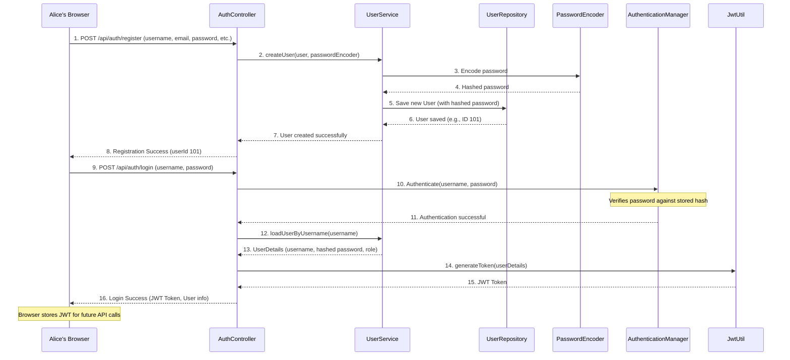

# Chapter 2: User & Authentication System

Welcome back to the CashCached project! In the [previous chapter](01_fd_product_catalog_.md), we explored how our system defines different types of Fixed Deposit (FD) products, like a bank creating its menu of offerings. But who gets to see this menu? Who can open an FD? And who can create new FD products or manage existing ones?

This is where the **User & Authentication System** comes in.

## What is the User & Authentication System?

Imagine a bank building. The **FD Product Catalog** is like the list of services and products available inside. But before you can access those services, you need to pass through the security desk! The security guard verifies your identity using your ID card, and once inside, you might only be allowed into certain areas based on whether you're a customer or an employee.

Our User & Authentication System does exactly this for our `cashcached` application:
*   **It identifies who you are**: Are you "John Doe" or "Jane Smith"?
*   **It confirms you are who you say you are (Authentication)**: Do you have the correct password, OTP, or Google ID?
*   **It determines what you can do (Authorization)**: Are you an Admin (like a bank employee who can set up new products) or a Customer (who can open and manage their FDs)?

This system is crucial for keeping our banking application secure and ensuring that only the right people can perform specific actions.

## Our Central Use Case: Getting Started with CashCached

Let's imagine two main scenarios for our system:

1.  **A New Customer, Alice, wants to open an FD.** First, she needs to sign up for an account, then log in.
2.  **An existing Admin, Bob, needs to manage FD products.** He just needs to log in to access the admin features.

The User & Authentication System makes both of these possible securely.

## Breaking Down the User & Authentication System

This system is built around a few key ideas:

| Concept              | What it Defines                                       | Analogy                                   |
| :------------------- | :---------------------------------------------------- | :---------------------------------------- |
| **User**             | A person who interacts with the application (e.g., Alice, Bob). | You, with your identity.                |
| **Role**             | What kind of user they are (e.g., `CUSTOMER`, `ADMIN`). | Your job title (customer or bank employee). |
| **Registration**     | How a new user creates an account.                      | Applying for a new bank account.          |
| **Login (Authentication)** | How a user proves their identity to the system.     | Showing your ID card at the security desk. |
| **Authorization**    | What a user is allowed to do after logging in.          | What rooms you're allowed into after verifying your ID. |
| **Security Token**   | A digital "pass" that shows you're logged in.           | A temporary visitor's badge.              |

Let's look at how users interact with these concepts.

### 1. User & Role: Who Are You and What's Your Job?

Every person using CashCached is a `User`. Each user has a `Role`, which dictates their permissions. In our system, the main roles are:
*   `CUSTOMER`: Can view available FD products, open new FDs, view their own FDs, and manage their profile.
*   `ADMIN`: Can do everything a customer can, PLUS create/update/delete FD products, manage other users, and access special admin reports. (Like we saw in [Chapter 1: FD Product Catalog](01_fd_product_catalog_.md), only an Admin can create a "Green Growth FD".)

### 2. Registration: Getting an Account

When someone new, like Alice, wants to use CashCached, she needs to register. This involves providing her details (username, email, password, etc.) to create her `User` account.

### 3. Login (Authentication): Proving Your Identity

After registering, users need to log in. Our system offers a few ways to prove who you are:
*   **Username and Password**: The most common method. You provide a unique username and a secret password.
*   **One-Time Password (OTP)**: For extra security, you can log in using your phone number, and the system sends a temporary code (OTP) to your phone. You enter this code to confirm your identity.
*   **Google OAuth**: You can use your existing Google account to log in, without needing a separate username and password for CashCached.

### 4. Authorization: What You Can Do

Once logged in, the system uses your `Role` to decide what you're allowed to do. If Alice (a `CUSTOMER`) tries to create a new FD product, the system will deny her access because only `ADMIN` users have that permission. This ensures data integrity and security.

### 5. Security Token: Staying Logged In

After you log in, the system gives you a special digital "pass" called a **JSON Web Token (JWT)**. Instead of checking your username and password every time you click something, your web browser just shows this token to prove you're still logged in and authorized. It's like a temporary visitor's badge you wear in the bank building.

## Solving Our Use Case: Alice Registers & Logs In

Let's see how Alice, a new customer, would register and then log in using different methods. We'll use example API calls, which are like digital messages sent to our `cashcached` system.

### Step 1: Alice Registers for a New Account

Alice sends a request to create her account.

```http
POST /api/auth/register
```

**Example Request Body (Input):**
```json
{
  "username": "alice_customer",
  "email": "alice@example.com",
  "password": "StrongPassword123!",
  "phoneNumber": "+1234567890",
  "preferredCurrency": "USD",
  "preferredLanguage": "EN"
}
```

**What Happens (Output):**
The system creates a new `User` account for Alice with the `CUSTOMER` role.
```json
{
  "message": "User registered successfully",
  "userId": 101 // Alice's new unique ID
}
```
*Explanation*: Alice's details are saved, and her password is encrypted for security. She is automatically assigned the `CUSTOMER` role.

### Step 2A: Alice Logs In with Username and Password

After registering, Alice logs in using her username and password.

```http
POST /api/auth/login
```

**Example Request Body (Input):**
```json
{
  "username": "alice_customer",
  "password": "StrongPassword123!"
}
```

**What Happens (Output):**
The system verifies her credentials and provides her with a `token` (JWT).
```json
{
  "token": "eyJhbGciOiJIUzI1NiIsInR5cCI6IkpXVCJ9.eyJzdWIiOiJhbGljZ...",
  "username": "alice_customer",
  "email": "alice@example.com",
  "role": "CUSTOMER",
  "phoneNumber": "+1234567890"
}
```
*Explanation*: This `token` is like Alice's temporary digital ID. Her browser will store this token and send it with future requests to prove she's logged in.

### Step 2B: Alice Logs In with OTP (Optional Alternative)

If Alice prefers, she can use her phone number to log in via OTP. This involves two steps:

#### Step 2B.1: Request an OTP

Alice asks the system to send an OTP to her phone.

```http
POST /api/auth/send-otp
```

**Example Request Body (Input):**
```json
{
  "phoneNumber": "+1234567890"
}
```

**What Happens (Output):**
The system generates a secret code and sends it to her phone number (if Twilio is configured, otherwise it prints to console in development).
```json
"OTP sent successfully"
```
*Explanation*: A temporary OTP is generated and stored for a short time (e.g., 5 minutes).

#### Step 2B.2: Verify the OTP

Alice receives the OTP on her phone and sends it back to the system.

```http
POST /api/auth/verify-otp
```

**Example Request Body (Input):**
```json
{
  "phoneNumber": "+1234567890",
  "otp": "123456" // The code Alice received
}
```

**What Happens (Output):**
If the OTP is correct and not expired, she gets a `token` (JWT).
```json
{
  "token": "eyJhbGciOiJIUzI1NiIsInR5cCI6IkpXVCJ9.eyJzdWIiOiJhbGljZ...",
  "username": "alice_customer",
  "email": "alice@example.com",
  "role": "CUSTOMER",
  "phoneNumber": "+1234567890"
}
```
*Explanation*: Just like with username/password, a valid OTP grants her a JWT token.

### Step 2C: Alice Logs In with Google OAuth (Optional Alternative)

If Alice chooses to "Sign in with Google", she would click a button on the login page.

**What Happens (High-level Output):**
1.  Alice is redirected to Google's login page.
2.  She logs into her Google account and grants permission to CashCached.
3.  Google sends her back to CashCached.
4.  CashCached automatically creates an account for her (if she's new) or links it to an existing one, then logs her in and redirects her to the customer dashboard.

*Explanation*: This uses Google's secure system to verify Alice's identity, making it easy for her to sign up and log in without managing another password.

## Behind the Scenes: How It Works

Let's peek under the hood to see how these authentication methods are handled within the `cashcached` project.

### Simplified Registration & Login Flow



### Database Structure

The `ER_DIAGRAM.md` file (which shows our database layout) includes key tables for user management:

*   **`USERS`**: This is the main table storing all user information: `username`, `email`, `phoneNumber`, `password` (hashed!), `role` (Admin/Customer), `googleId` (if signed up via Google), etc.
*   **`OTP_VERIFICATIONS`**: A temporary table used for the OTP login method. It stores the `phoneNumber`, the `otp` sent, and its `expiryTime`.

### Code References

Let's look at the important code components.

#### The `User` Entity (`src/main/java/com/bank/fdsimulator/entity/User.java`)

This Java class is the blueprint for how we store user information in our database.

```java
// ... imports ...
@Entity
@Table(name = "users")
public class User {

    @Id
    @GeneratedValue(strategy = GenerationType.IDENTITY)
    private Long id; // Unique ID for each user

    @Column(unique = true, nullable = false)
    private String username;

    @Email @Column(unique = true, nullable = false)
    private String email;

    private String phoneNumber;

    @JsonIgnore // Don't send password back to browser directly
    private String password; // Stored as a hashed value

    @Enumerated(EnumType.STRING)
    @Column(nullable = false)
    private Role role; // ADMIN or CUSTOMER

    private String googleId; // For Google OAuth users

    // ... other fields like preferredCurrency, preferredLanguage, timestamps ...

    // ... getters, setters, constructors ...
}
```
*Explanation*: This `User` entity maps directly to the `USERS` table. Notice the `@JsonIgnore` on the `password` field – this prevents the actual password (even hashed) from being accidentally sent back in API responses. The `role` field is super important for authorization.

#### The `Role` Enum (`src/main/java/com/bank/fdsimulator/entity/Role.java`)

This simple file defines the possible roles for users in our system.

```java
package com.bank.fdsimulator.entity;

public enum Role {
    ADMIN,
    CUSTOMER
}
```
*Explanation*: Enums (short for "enumerations") are a clear way to define a fixed set of values. Here, a user can only be an `ADMIN` or a `CUSTOMER`.

#### The `UserRepository` (`src/main/java/com/bank/fdsimulator/repository/UserRepository.java`)

This is how our application talks to the `USERS` database table to find or save user information.

```java
// ... imports ...
@Repository
public interface UserRepository extends JpaRepository<User, Long> {

    Optional<User> findByUsername(String username); // Find user by username
    Optional<User> findByEmail(String email);       // Find user by email
    Optional<User> findByPhoneNumber(String phoneNumber); // Find user by phone
    Optional<User> findByGoogleId(String googleId); // Find user by Google ID

    boolean existsByUsername(String username);      // Check if username exists
    // ... other methods ...
}
```
*Explanation*: This `UserRepository` interface provides methods to perform common database operations on `User` objects, like finding a user by their username or checking if an email already exists. `Optional` is used to handle cases where a user might not be found.

#### The `AuthController` (`src/main/java/com/bank/fdsimulator/controller/AuthController.java`)

This is the "front desk" for all authentication-related API calls.

```java
// ... imports ...
@RestController
@RequestMapping("/api/auth")
public class AuthController {

    @Autowired private AuthenticationManager authenticationManager;
    @Autowired private UserService userService;
    @Autowired private JwtUtil jwtUtil;
    @Autowired private OtpService otpService;
    @Autowired private PasswordEncoder passwordEncoder;

    @PostMapping("/register")
    public ResponseEntity<?> register(@Valid @RequestBody RegisterRequest request) {
        // ... checks if user already exists ...
        User user = new User();
        user.setUsername(request.getUsername());
        user.setPassword(request.getPassword()); // Password will be encoded by UserService
        user.setRole(Role.CUSTOMER); // New registrations default to CUSTOMER
        // ... set other user details ...
        User savedUser = userService.createUser(user, passwordEncoder); // Encodes password & saves
        // ... return success response ...
    }

    @PostMapping("/login")
    public ResponseEntity<?> login(@Valid @RequestBody LoginRequest request) {
        Authentication authentication = authenticationManager.authenticate(
            new UsernamePasswordAuthenticationToken(request.getUsername(), request.getPassword())
        );
        // If authentication succeeds, generate JWT
        UserDetails userDetails = userService.loadUserByUsername(request.getUsername());
        String jwt = jwtUtil.generateToken(userDetails);
        // ... return LoginResponse with JWT ...
    }

    @PostMapping("/send-otp")
    public ResponseEntity<?> sendOtp(@Valid @RequestBody OtpRequest request) {
        otpService.sendOtp(request.getPhoneNumber()); // Calls OTP service to send SMS
        return ResponseEntity.ok("OTP sent successfully");
    }

    @PostMapping("/verify-otp")
    public ResponseEntity<?> verifyOtp(@Valid @RequestBody OtpRequest request) {
        boolean isValid = otpService.verifyOtp(request.getPhoneNumber(), request.getOtp());
        if (isValid) {
            // Find user by phone, generate JWT, return response
        }
        // ... handle invalid OTP ...
    }
    // ... logout endpoint ...
}
```
*Explanation*: This controller exposes the API endpoints for `/register`, `/login`, `/send-otp`, and `/verify-otp`. It uses `UserService` to manage user data, `AuthenticationManager` to check passwords, `JwtUtil` to create tokens, and `OtpService` for OTP functionality.

#### The `UserService` (`src/main/java/com/bank/fdsimulator/service/UserService.java`)

This service acts as the central logic for all user-related operations.

```java
// ... imports ...
@Service @Transactional
public class UserService implements UserDetailsService { // Implements Spring Security's UserDetailsService

    @Autowired private UserRepository userRepository;
    @Autowired private AuditService auditService; // Logs user actions

    public User createUser(User user, PasswordEncoder passwordEncoder) {
        user.setPassword(passwordEncoder.encode(user.getPassword())); // IMPORTANT: Hash password!
        User savedUser = userRepository.save(user);
        auditService.logUserAction(savedUser, "USER_CREATED", "User account created");
        return savedUser;
    }

    // This method is called by Spring Security during login to fetch user details
    @Override
    public UserDetails loadUserByUsername(String username) throws UsernameNotFoundException {
        User user = userRepository.findByUsername(username)
                .orElseThrow(() -> new UsernameNotFoundException("User not found: " + username));
        
        // Return Spring Security's User object with username, password, and roles
        return new org.springframework.security.core.userdetails.User(
                user.getUsername(),
                user.getPassword(), // Hashed password
                user.isEnabled(),
                user.isAccountNonExpired(),
                user.isCredentialsNonExpired(),
                user.isAccountNonLocked(),
                Collections.singletonList(new SimpleGrantedAuthority("ROLE_" + user.getRole().name()))
        );
    }
    // ... other methods like updateUser, deleteUser, findByEmail, etc. ...
}
```
*Explanation*: The `UserService` is where the password hashing happens (`passwordEncoder.encode()`) before a new user is saved. It also implements `UserDetailsService`, which is a key part of Spring Security. When a user tries to log in, Spring Security calls `loadUserByUsername` to get the user's details (including their hashed password and `Role`) to verify their identity.

#### OTP System (`OtpService.java` and `OtpVerification.java`)

The OTP system involves generating a code, storing it temporarily, sending it, and then verifying it.

**`OtpService.java` (`src/main/java/com/bank/fdsimulator/service/OtpService.java`)**
```java
// ... imports ...
@Service @Transactional
public class OtpService {

    @Autowired private OtpVerificationRepository otpRepository;
    @Autowired private SmsService smsService; // Used to actually send the SMS

    private static final int OTP_VALIDITY_MINUTES = 5;

    public String generateOtp() { /* ... generates a 6-digit random code ... */ return "123456"; }

    public void sendOtp(String phoneNumber) {
        // ... cleanup old OTPs for this number ...
        String otp = generateOtp();
        LocalDateTime expiryTime = LocalDateTime.now().plusMinutes(OTP_VALIDITY_MINUTES);
        OtpVerification otpVerification = new OtpVerification(phoneNumber, otp, expiryTime);
        otpRepository.save(otpVerification); // Save OTP to DB
        smsService.sendOtp(phoneNumber, otp); // Send OTP via SMS (or log in dev mode)
    }

    public boolean verifyOtp(String phoneNumber, String otp) {
        Optional<OtpVerification> otpVerification = otpRepository
                .findByPhoneNumberAndOtpAndVerifiedFalse(phoneNumber, otp);
        
        if (otpVerification.isPresent() && otpVerification.get().getExpiryTime().isAfter(LocalDateTime.now())) {
            otpVerification.get().setVerified(true); // Mark as used
            otpRepository.save(otpVerification.get());
            return true; // OTP is valid!
        }
        return false; // OTP invalid or expired
    }
    // ... scheduled cleanup of expired OTPs ...
}
```
*Explanation*: The `OtpService` generates a random OTP, saves it with an expiry time, and then uses the `SmsService` to deliver it. When verifying, it checks the OTP against the stored one and ensures it hasn't expired.

**`OtpVerification.java` (`src/main/java/com/bank/fdsimulator/entity/OtpVerification.java`)**
```java
// ... imports ...
@Entity @Table(name = "otp_verifications")
public class OtpVerification {
    
    @Id @GeneratedValue(strategy = GenerationType.IDENTITY)
    private Long id;
    
    @Column(nullable = false)
    private String phoneNumber;
    
    @Column(nullable = false)
    private String otp;
    
    @Column(nullable = false)
    private LocalDateTime expiryTime; // When the OTP becomes invalid
    
    @Column(nullable = false)
    private boolean verified = false; // Has this OTP been successfully used?

    // ... constructors, getters, setters ...
}
```
*Explanation*: This entity represents a single OTP record, storing all necessary details for verification.

#### The `SecurityConfig` (`src/main/java/com/bank/fdsimulator/config/SecurityConfig.java`)

This configuration file is the "brain" of our security system. It tells Spring how to handle authentication.

```java
// ... imports ...
@Configuration @EnableWebSecurity @EnableMethodSecurity(prePostEnabled = true)
public class SecurityConfig {
    
    @Autowired private JwtAuthenticationFilter jwtAuthenticationFilter;
    @Autowired private OAuth2LoginSuccessHandler oAuth2LoginSuccessHandler;
    
    @Bean // Tells Spring how to encrypt passwords
    public PasswordEncoder passwordEncoder() { return new BCryptPasswordEncoder(); }
    
    @Bean // How to authenticate users from our database (username/password)
    public DaoAuthenticationProvider authenticationProvider(UserService userService) {
        DaoAuthenticationProvider authProvider = new DaoAuthenticationProvider();
        authProvider.setUserDetailsService(userService); // Uses our UserService
        authProvider.setPasswordEncoder(passwordEncoder());
        return authProvider;
    }
    
    @Bean // Configures HTTP security rules
    public SecurityFilterChain filterChain(HttpSecurity http) throws Exception {
        http.csrf(csrf -> csrf.ignoringRequestMatchers("/api/**")) // Disable CSRF for API
            .authorizeHttpRequests(authz -> authz
                .requestMatchers("/api/auth/**").permitAll() // Allow registration/login without token
                // ... other public/admin/customer paths ...
                .anyRequest().authenticated() // All other requests need authentication
            )
            .oauth2Login(oauth2 -> oauth2 // Enable Google OAuth2 login
                .loginPage("/login")
                .successHandler(oAuth2LoginSuccessHandler) // Custom handler after Google login
            )
            .addFilterBefore(jwtAuthenticationFilter, UsernamePasswordAuthenticationFilter.class); // Use JWT filter
        // ... session management, logout, exception handling ...
        return http.build();
    }
    // ... CORS configuration ...
}
```
*Explanation*: This class sets up Spring Security. It defines:
1.  **`PasswordEncoder`**: How passwords are encrypted (using `BCryptPasswordEncoder`).
2.  **`DaoAuthenticationProvider`**: How to authenticate users using their username and the encrypted passwords stored in our database (by using our `UserService`).
3.  **`filterChain`**: The main security rules:
    *   It specifies which URLs are publicly accessible (like `/api/auth/register`).
    *   It enables `oauth2Login` for Google sign-in and uses a special `oAuth2LoginSuccessHandler` to manage users who log in this way.
    *   It adds a `JwtAuthenticationFilter` to ensure that API requests *after* login include a valid JWT.

#### JWT Token Handling (`JwtUtil.java` and `JwtAuthenticationFilter.java`)

These two classes handle the creation and verification of the security tokens (JWTs).

**`JwtUtil.java` (`src/main/java/com/bank/fdsimulator/security/JwtUtil.java`)**
```java
// ... imports ...
@Component
public class JwtUtil {
    
    @Value("${jwt.secret:mySecretKey123...}") private String secret; // Secret key for signing tokens
    @Value("${jwt.expiration:120000}") private Long expiration; // How long tokens are valid (milliseconds)

    public String extractUsername(String token) { /* ... extracts username from token ... */ return "alice_customer"; }
    public Boolean isTokenExpired(String token) { /* ... checks if token's expiry date is past ... */ return false; }
    
    public String generateToken(UserDetails userDetails) {
        Map<String, Object> claims = new HashMap<>();
        // Create token with username, issue date, expiry date, and sign it with our secret
        return Jwts.builder()
                .setSubject(userDetails.getUsername())
                .setIssuedAt(new Date(System.currentTimeMillis()))
                .setExpiration(new Date(System.currentTimeMillis() + expiration))
                .signWith(getSigningKey(), SignatureAlgorithm.HS256)
                .compact();
    }
    
    public Boolean validateToken(String token, UserDetails userDetails) {
        final String username = extractUsername(token);
        return (username.equals(userDetails.getUsername()) && !isTokenExpired(token));
    }
}
```
*Explanation*: `JwtUtil` is responsible for generating new JWT tokens after a successful login and for extracting information (like the username) from an existing token. It also checks if a token is still valid and not expired.

**`JwtAuthenticationFilter.java` (`src/main/java/com/bank/fdsimulator/security/JwtAuthenticationFilter.java`)**
```java
// ... imports ...
@Component
public class JwtAuthenticationFilter extends OncePerRequestFilter {
    
    @Autowired private UserService userService;
    @Autowired private JwtUtil jwtUtil;
    
    @Override
    protected void doFilterInternal(@NonNull HttpServletRequest request, @NonNull HttpServletResponse response, 
                                  @NonNull FilterChain filterChain) throws ServletException, IOException {
        
        // Only process JWT for API endpoints
        if (!request.getRequestURI().startsWith("/api/")) {
            filterChain.doFilter(request, response);
            return;
        }
        
        final String authorizationHeader = request.getHeader("Authorization"); // Get token from "Bearer ..." header
        String username = null;
        String jwt = null;
        
        if (authorizationHeader != null && authorizationHeader.startsWith("Bearer ")) {
            jwt = authorizationHeader.substring(7); // Extract the token part
            username = jwtUtil.extractUsername(jwt); // Get username from token
        }
        
        if (username != null && SecurityContextHolder.getContext().getAuthentication() == null) {
            UserDetails userDetails = userService.loadUserByUsername(username); // Load user details
            if (jwtUtil.validateToken(jwt, userDetails)) { // Validate the token
                // If valid, set the user as authenticated in Spring Security's context
                UsernamePasswordAuthenticationToken authToken = 
                    new UsernamePasswordAuthenticationToken(userDetails, null, userDetails.getAuthorities());
                SecurityContextHolder.getContext().setAuthentication(authToken);
            }
        }
        filterChain.doFilter(request, response);
    }
}
```
*Explanation*: This `JwtAuthenticationFilter` is like the "token checker" that runs before most API requests. It grabs the JWT from the request header, uses `JwtUtil` to validate it, and if it's good, tells Spring Security that the user is authenticated for that request.

#### Google OAuth Success Handler (`OAuth2LoginSuccessHandler.java`)

This custom handler is called when a user successfully logs in via Google.

```java
// ... imports ...
@Component
public class OAuth2LoginSuccessHandler extends SimpleUrlAuthenticationSuccessHandler {
    
    @Autowired private UserService userService;
    
    @Override
    public void onAuthenticationSuccess(HttpServletRequest request, HttpServletResponse response,
                                      Authentication authentication) throws IOException, ServletException {
        try {
            OAuth2User oAuth2User = (OAuth2User) authentication.getPrincipal();
            Map<String, Object> attributes = oAuth2User.getAttributes();
            
            String email = (String) attributes.get("email");
            String googleId = (String) attributes.get("sub");
            
            User user = userService.findByGoogleId(googleId).orElse(null);
            
            if (user == null) {
                // If new user via Google, create a new User account
                user = new User();
                user.setUsername(email.split("@")[0] + "_google"); // Create a unique username
                user.setEmail(email);
                user.setGoogleId(googleId);
                user.setRole(Role.CUSTOMER);
                user.setPassword("OAUTH_USER_" + java.util.UUID.randomUUID().toString()); // Set dummy password
                user = userService.createUser(user, new org.springframework.security.crypto.bcrypt.BCryptPasswordEncoder());
            } else {
                // If existing user, update any details (like profile picture)
                user = userService.updateUser(user);
            }
            
            // Redirect based on user's role
            if (user.getRole() == Role.ADMIN) {
                getRedirectStrategy().sendRedirect(request, response, "/admin/dashboard");
            } else {
                getRedirectStrategy().sendRedirect(request, response, "/customer/dashboard");
            }
        } catch (Exception e) { /* ... handle errors ... */ }
    }
}
```
*Explanation*: After Google confirms the user's identity, this handler takes the user's Google details (email, Google ID). It checks if a `User` with that `googleId` already exists. If not, it creates a new `User` account, sets their role to `CUSTOMER`, and then redirects them to the appropriate dashboard (customer or admin).

## Conclusion

In this chapter, we've unlocked the doors to our CashCached application by understanding the **User & Authentication System**. We learned how users are identified by their `Role` (Admin or Customer) and how they can `Register` for new accounts. We explored the different ways users can `Login` – using a username/password, a One-Time Password (OTP), or conveniently with Google OAuth. Finally, we saw how security tokens (JWTs) keep users logged in and how the system `Authorizes` what each user can do based on their role, keeping everything secure and orderly.

Now that we know who can access the system and how, we're ready to dive into the core banking logic: managing Fixed Deposits!

[Next Chapter: Fixed Deposit Core (FD Management)](03_fixed_deposit_core__fd_management__.md)

---
<sub><sup>**References**: [[1]](https://github.com/Arrowsincoming24/cashcached_final_integrated_repo/blob/72a6d5993708a94c0b2c9f66855bcf0f09b48506/src/main/java/com/bank/fdsimulator/config/SecurityConfig.java), [[2]](https://github.com/Arrowsincoming24/cashcached_final_integrated_repo/blob/72a6d5993708a94c0b2c9f66855bcf0f09b48506/src/main/java/com/bank/fdsimulator/controller/AuthController.java), [[3]](https://github.com/Arrowsincoming24/cashcached_final_integrated_repo/blob/72a6d5993708a94c0b2c9f66855bcf0f09b48506/src/main/java/com/bank/fdsimulator/entity/OtpVerification.java), [[4]](https://github.com/Arrowsincoming24/cashcached_final_integrated_repo/blob/72a6d5993708a94c0b2c9f66855bcf0f09b48506/src/main/java/com/bank/fdsimulator/entity/Role.java), [[5]](https://github.com/Arrowsincoming24/cashcached_final_integrated_repo/blob/72a6d5993708a94c0b2c9f66855bcf0f09b48506/src/main/java/com/bank/fdsimulator/entity/User.java), [[6]](https://github.com/Arrowsincoming24/cashcached_final_integrated_repo/blob/72a6d5993708a94c0b2c9f66855bcf0f09b48506/src/main/java/com/bank/fdsimulator/repository/UserRepository.java), [[7]](https://github.com/Arrowsincoming24/cashcached_final_integrated_repo/blob/72a6d5993708a94c0b2c9f66855bcf0f09b48506/src/main/java/com/bank/fdsimulator/security/JwtAuthenticationFilter.java), [[8]](https://github.com/Arrowsincoming24/cashcached_final_integrated_repo/blob/72a6d5993708a94c0b2c9f66855bcf0f09b48506/src/main/java/com/bank/fdsimulator/security/JwtUtil.java), [[9]](https://github.com/Arrowsincoming24/cashcached_final_integrated_repo/blob/72a6d5993708a94c0b2c9f66855bcf0f09b48506/src/main/java/com/bank/fdsimulator/security/OAuth2LoginSuccessHandler.java), [[10]](https://github.com/Arrowsincoming24/cashcached_final_integrated_repo/blob/72a6d5993708a94c0b2c9f66855bcf0f09b48506/src/main/java/com/bank/fdsimulator/service/OtpService.java), [[11]](https://github.com/Arrowsincoming24/cashcached_final_integrated_repo/blob/72a6d5993708a94c0b2c9f66855bcf0f09b48506/src/main/java/com/bank/fdsimulator/service/SmsService.java), [[12]](https://github.com/Arrowsincoming24/cashcached_final_integrated_repo/blob/72a6d5993708a94c0b2c9f66855bcf0f09b48506/src/main/java/com/bank/fdsimulator/service/UserService.java)</sup></sub>
