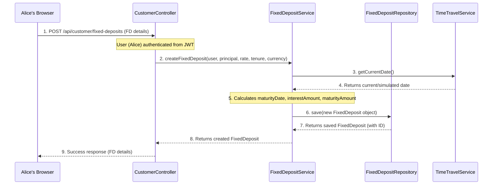

# Chapter 3: Fixed Deposit Core (FD Management)

Welcome back to the CashCached project! In the [previous chapter](02_user___authentication_system_.md), we learned how users can register, log in, and how our system keeps track of who they are (customer or admin). Before that, in [Chapter 1: FD Product Catalog](01_fd_product_catalog_.md), we explored how the bank defines different types of Fixed Deposit (FD) products, like a menu of options.

Now that we have our menu and our customers ready to order, it's time to talk about the actual *meal* – the individual Fixed Deposits themselves!

## What is the Fixed Deposit Core (FD Management)?

Imagine you walk into a bank, look at their menu of FD products (like the "Green Growth FD" we set up in Chapter 1), and decide to open one. The **Fixed Deposit Core (FD Management)** is the part of our CashCached system that handles *your specific* FD. It's like your personal contract with the bank for that particular savings plan.

This "core" is responsible for:
*   **Creating** a new FD when a customer decides to open one.
*   **Tracking its details**: How much money is in it (principal), what's the interest rate, how long will it last (tenure).
*   **Managing its lifecycle**: Is it `ACTIVE` (still earning interest), `MATURED` (reached its end date), or `PREMATURE_CLOSED` (closed early)?
*   **Calculating** how much money it will be worth when it matures.

In short, it's the heart of our banking simulator, managing every single FD that a customer opens.

## Our Central Use Case: Opening a New Fixed Deposit

Let's revisit Alice, our customer from Chapter 2. She has successfully logged into CashCached. Now, she wants to put some of her savings into a Fixed Deposit.

Here's what she wants to do:
1.  **Choose an FD Product**: She'll likely browse the available products (like the "Green Growth FD" from Chapter 1).
2.  **Provide Details**: She needs to specify how much money she wants to deposit (e.g., $10,000) and for how long (e.g., 24 months). The system will then use rules from the chosen product to apply the correct interest rate.
3.  **Create the FD**: The system will then create her new FD account, tell her when it will mature, and how much money she will get back.

This process involves linking her user account, a specific FD product, and then creating a unique instance of a Fixed Deposit just for her.

## Key Concepts in FD Management

To understand how this core works, let's break down the main ideas:

| Concept            | What it Represents                                   | Analogy                                   |
| :----------------- | :--------------------------------------------------- | :---------------------------------------- |
| **Fixed Deposit**  | A single instance of a customer's savings contract.  | Your personal FD certificate.             |
| **Principal Amount** | The initial money deposited.                         | The amount you first put in.              |
| **Interest Rate**  | The percentage earned on the deposit.                | How much extra money the bank promises.   |
| **Tenure**         | The duration of the deposit (e.g., in months).      | How long your money stays in the bank.    |
| **FD Status**      | The current state of the FD (`ACTIVE`, `MATURED`, etc.). | The "active" or "expired" stamp on your certificate. |
| **Maturity Date**  | The date when the FD finishes its term.              | The "end date" on your certificate.       |
| **Maturity Amount**| The total amount (principal + interest) at maturity. | The final payout.                         |

### 1. The Fixed Deposit (FD)

At its core, a **Fixed Deposit** is an object that holds all the specific details of a customer's investment. It's directly linked to:
*   **A `User`**: Who opened this FD? (From [Chapter 2: User & Authentication System](02_user___authentication_system_.md))
*   **An `FdProduct`**: Which type of FD product is this based on? (From [Chapter 1: FD Product Catalog](01_fd_product_catalog_.md))

It tracks things like the `principalAmount`, `interestRate`, `tenureInMonths`, its `status`, and crucial dates like `startDate` and `maturityDate`.

### 2. The FD Lifecycle (Status)

An FD doesn't just appear and disappear. It goes through different phases, which we track using its `status`:

*   **`ACTIVE`**: The FD is currently active, earning interest, and hasn't reached its maturity date.
*   **`MATURED`**: The FD has reached its `maturityDate`. It's no longer earning interest and the customer can now withdraw the full `maturityAmount`.
*   **`PREMATURE_CLOSED`**: The customer chose to close the FD before its `maturityDate`. There might be penalties (defined by [Business Rules](01_fd_product_catalog_.md)).
*   **`CANCELLED`**: (Less common in this context, might be for FDs cancelled before activation or due to errors).

### 3. Calculating Maturity Amount

One of the most important jobs of the FD Core is to calculate the final amount a customer receives. This usually involves a simple interest calculation for this simulator:

`Interest Amount = Principal Amount * (Interest Rate / 100) * (Tenure in Months / 12)`
`Maturity Amount = Principal Amount + Interest Amount`

This calculation happens when the FD is first created, giving the customer a clear expectation of their returns.

## Solving Our Use Case: Alice Opens an FD

Let's see how Alice, after logging in, can open a new Fixed Deposit. She will use the customer-facing API endpoint.

### Step 1: Alice Submits Her FD Request

Alice, having reviewed the available products (from [Chapter 1: FD Product Catalog](01_fd_product_catalog_.md)), decides to open an FD with a principal of $5,000 for 24 months. For simplicity in this tutorial, we'll assume she directly provides the interest rate (e.g., 4.5%), though in a real application, this rate would come from the chosen `FdProduct` and its `RateMatrix`.

```http
POST /api/customer/fixed-deposits
```

**Example Request Body (Input):**
```json
{
  "principalAmount": 5000.00,
  "interestRate": 4.50,
  "tenureInMonths": 24,
  "currency": "USD"
}
```

**What Happens (Output):**
The system processes her request, calculates the interest and maturity amount, and creates her new FD.

```json
{
  "id": 12345,
  "user": { /* Alice's user details */ },
  "product": null, // Could be linked to a specific FdProduct in a more advanced scenario
  "principalAmount": 5000.00,
  "currency": "USD",
  "interestRate": 4.50,
  "tenureInMonths": 24,
  "status": "ACTIVE",
  "maturityAmount": 5450.00, // Calculated: 5000 + (5000 * 4.5/100 * 24/12)
  "interestAmount": 450.00,
  "startDate": "2023-10-26T10:00:00",
  "maturityDate": "2025-10-26T10:00:00",
  "createdAt": "2023-10-26T10:00:00",
  "updatedAt": "2023-10-26T10:00:00"
}
```
*Explanation*: A new `FixedDeposit` is created for Alice. It automatically sets the `status` to `ACTIVE`, calculates the `maturityDate` (24 months from `startDate`), and determines the `interestAmount` and `maturityAmount`. This `id` (e.g., `12345`) is now her unique FD number.

## Behind the Scenes: How an FD is Created

Let's see the simplified steps that happen internally when Alice creates her Fixed Deposit.

### Simplified FD Creation Flow


*Explanation*: Alice's browser sends the request to the `CustomerController`. The controller then passes the details, along with Alice's user information (obtained from her login token, as discussed in [Chapter 2](02_user___authentication_system_.md)), to the `FixedDepositService`. This service fetches the current date (which might be a simulated date if time travel is enabled, from [Chapter 4](04_time_travel___batch_processing_.md)), performs the necessary calculations, and then saves the new `FixedDeposit` record to the database via the `FixedDepositRepository`. Finally, the created FD's details are sent back to Alice.

### Database Structure

The `ER_DIAGRAM.md` file shows how Fixed Deposits are stored. The main table here is `FIXED_DEPOSITS`.

*   **`FIXED_DEPOSITS`**: This table stores each individual FD opened by a customer.
    *   It has columns like `id`, `principal_amount`, `interest_rate`, `tenure_months`, `status`, `start_date`, `maturity_date`, `maturity_amount`, and `interest_amount`.
    *   Crucially, it has `user_id` which links it to the `USERS` table (who owns this FD).
    *   It also has `product_id` which links it to the `FD_PRODUCTS` table (what kind of FD is this).

### Code References

Let's look at some simplified code that makes this happen.

#### The `FixedDeposit` Entity (`src/main/java/com/bank/fdsimulator/entity/FixedDeposit.java`)

This is the blueprint for a single Fixed Deposit in our system, mapping to the `FIXED_DEPOSITS` table.

```java
// ... package and imports ...
@Entity
@Table(name = "fixed_deposits")
public class FixedDeposit {

    @Id
    @GeneratedValue(strategy = GenerationType.IDENTITY)
    private Long id; // Unique ID for this specific FD

    @ManyToOne(fetch = FetchType.EAGER)
    @JoinColumn(name = "user_id", nullable = false)
    private User user; // Link to the customer who owns this FD

    @ManyToOne(fetch = FetchType.EAGER)
    @JoinColumn(name = "product_id")
    private FdProduct product; // Link to the FD product from catalog

    private BigDecimal principalAmount;
    private BigDecimal interestRate;
    private Integer tenureInMonths;

    @Enumerated(EnumType.STRING)
    private FdStatus status; // Current status: ACTIVE, MATURED, etc.

    private BigDecimal maturityAmount;
    private BigDecimal interestAmount;
    private LocalDateTime startDate;
    private LocalDateTime maturityDate;

    // ... getters, setters, constructors ...
}
```
*Explanation*: This Java class defines what information each Fixed Deposit object holds. Notice the `@ManyToOne` relationships to `User` and `FdProduct`. This is how our system knows who owns the FD and what product rules apply to it.

#### The `FdStatus` Enum (`src/main/java/com/bank/fdsimulator/entity/FdStatus.java`)

This simple enumeration defines the possible states an FD can be in.

```java
package com.bank.fdsimulator.entity;

public enum FdStatus {
    ACTIVE,
    MATURED,
    PREMATURE_CLOSED,
    CANCELLED
}
```
*Explanation*: Using an `enum` ensures that an FD can only have one of these predefined statuses, keeping our data consistent.

#### The `FdCreateRequest` DTO (`src/main/java/com/bank/fdsimulator/dto/FdCreateRequest.java`)

This is the simple data structure that Alice's browser sends to the server when she requests a new FD. "DTO" stands for Data Transfer Object.

```java
// ... package and imports ...
public class FdCreateRequest {

    private BigDecimal principalAmount;
    private BigDecimal interestRate;
    private Integer tenureInMonths;
    private String currency = "USD"; // Default currency

    // ... getters, setters, constructors ...
}
```
*Explanation*: This DTO acts as a clear contract for what information the client needs to provide to open an FD. The server then takes this information to create the `FixedDeposit` entity.

#### The `FixedDepositRepository` (`src/main/java/com/bank/fdsimulator/repository/FixedDepositRepository.java`)

This interface is how our application talks to the database specifically for `FixedDeposit` objects.

```java
// ... package and imports ...
@Repository
public interface FixedDepositRepository extends JpaRepository<FixedDeposit, Long> {

    List<FixedDeposit> findByUser(User user); // Find all FDs for a specific user
    List<FixedDeposit> findByUserAndStatus(User user, FdStatus status); // FDs by user and status
    List<FixedDeposit> findByStatus(FdStatus status); // All FDs with a specific status

    // Custom query to find FDs that have matured by a given date
    @Query("SELECT fd FROM FixedDeposit fd WHERE fd.maturityDate <= :currentDate AND fd.status = 'ACTIVE'")
    List<FixedDeposit> findMaturedFds(@Param("currentDate") LocalDateTime currentDate);

    // ... other methods ...
}
```
*Explanation*: This repository provides methods to easily fetch, save, and update `FixedDeposit` records in the database. The `@Query` annotation shows how we can write custom searches, like finding all `ACTIVE` FDs whose `maturityDate` is on or before a `currentDate`.

#### The `FixedDepositService` (`src/main/java/com/bank/fdsimulator/service/FixedDepositService.java`)

This service contains the core business logic for FD management, like creating FDs and calculating amounts.

```java
// ... package and imports ...
@Service
@Transactional // Ensures operations are treated as a single unit
public class FixedDepositService {

    @Autowired private FixedDepositRepository fdRepository;
    @Autowired private AuditService auditService; // For logging actions
    @Autowired private SmsService smsService; // For sending notifications

    public FixedDeposit createFixedDeposit(User user, BigDecimal principalAmount,
                                         BigDecimal interestRate, Integer tenureInMonths, Currency currency) {
        FixedDeposit fd = new FixedDeposit(user, principalAmount, interestRate, tenureInMonths, FdStatus.ACTIVE);
        fd.setCurrency(currency);

        // Calculate maturity amount
        BigDecimal interestAmount = calculateInterest(principalAmount, interestRate, tenureInMonths);
        BigDecimal maturityAmount = principalAmount.add(interestAmount);

        fd.setInterestAmount(interestAmount);
        fd.setMaturityAmount(maturityAmount);

        FixedDeposit savedFd = fdRepository.save(fd); // Save to database
        auditService.logUserAction(user, "FD_CREATED", "FixedDeposit"); // Log the action
        // ... (SMS notification code omitted for brevity) ...

        return savedFd;
    }

    public BigDecimal calculateInterest(BigDecimal principal, BigDecimal rate, Integer months) {
        // Simple interest formula: P * R * T / 100
        BigDecimal timeInYears = BigDecimal.valueOf(months).divide(BigDecimal.valueOf(12), 4, RoundingMode.HALF_UP);
        return principal.multiply(rate).multiply(timeInYears).divide(BigDecimal.valueOf(100), 2, RoundingMode.HALF_UP);
    }

    public BigDecimal calculateMaturityAmount(BigDecimal principal, BigDecimal rate, Integer months) {
        BigDecimal interest = calculateInterest(principal, rate, months);
        return principal.add(interest);
    }

    public void closeFixedDeposit(Long id, User user) {
        FixedDeposit fd = getFixedDepositById(id);
        if (fd.getStatus() == FdStatus.ACTIVE) {
            fd.setStatus(FdStatus.PREMATURE_CLOSED); // Change status to closed
            fdRepository.save(fd);
            auditService.logUserAction(user, "FD_CLOSED", "FixedDeposit");
            // ... (SMS notification code omitted for brevity) ...
        }
    }
    // ... other methods like getFixedDepositsByUser, updateFixedDepositStatus, etc. ...
}
```
*Explanation*: The `FixedDepositService` is where the core logic resides. The `createFixedDeposit` method orchestrates the creation of a new FD, calling `calculateInterest` and `calculateMaturityAmount` to fill in the financial details before saving it. It also logs the action using the `AuditService` and could send notifications via `SmsService`. The `@Transactional` annotation ensures that all database operations within this method either succeed together or are completely rolled back if any part fails, maintaining data integrity.

#### The `CustomerController` (`src/main/java/com/bank/fdsimulator/controller/CustomerController.java`)

This controller exposes the API endpoints specifically for customers, including opening a new FD.

```java
// ... package and imports ...
@RestController
@RequestMapping("/api/customer")
public class CustomerController {

    @Autowired private FixedDepositService fdService;
    @Autowired private AuditService auditService;

    @PostMapping("/fixed-deposits")
    public ResponseEntity<FixedDeposit> createFixedDeposit(@Valid @RequestBody FdCreateRequest request,
                                                          Authentication authentication,
                                                          HttpServletRequest httpRequest) {
        User user = (User) authentication.getPrincipal(); // Get current logged-in user

        // Call the service to create the FD
        FixedDeposit fd = fdService.createFixedDeposit(
            user,
            request.getPrincipalAmount(),
            request.getInterestRate(),
            request.getTenureInMonths(),
            Currency.fromCode(request.getCurrency())
        );

        auditService.logUserAction(user, "FD_CREATED", "FixedDeposit", fd.getId(), httpRequest);
        return ResponseEntity.ok(fd); // Return the created FD details
    }

    @GetMapping("/fixed-deposits")
    public ResponseEntity<List<FixedDeposit>> getMyFixedDeposits(Authentication authentication) {
        User user = (User) authentication.getPrincipal();
        List<FixedDeposit> fds = fdService.getFixedDepositsByUser(user);
        return ResponseEntity.ok(fds); // Allow customer to view their own FDs
    }

    @PostMapping("/fixed-deposits/{id}/close")
    public ResponseEntity<?> closeFixedDeposit(@PathVariable Long id,
                                             Authentication authentication,
                                             HttpServletRequest httpRequest) {
        User user = (User) authentication.getPrincipal();
        // Check if the FD belongs to the user before closing
        // ... (access check omitted for brevity, but implemented in actual code) ...
        fdService.closeFixedDeposit(id, user);
        return ResponseEntity.ok("Fixed Deposit closed successfully");
    }
    // ... other endpoints for customer dashboard, calculations, etc. ...
}
```
*Explanation*: The `CustomerController` receives the `FdCreateRequest` from the customer's browser. It extracts the logged-in `User` information from the `Authentication` object (provided by [Chapter 2: User & Authentication System](02_user___authentication_system_.md)) and then delegates the actual FD creation to the `FixedDepositService`. It also provides endpoints for customers to view and manage their *own* FDs.

## Conclusion

In this chapter, we've explored the **Fixed Deposit Core (FD Management)**, the crucial part of CashCached that handles individual Fixed Deposit accounts. We learned how FDs are created, how their `status` tracks their lifecycle, and how key financial amounts like `maturityAmount` are calculated. We also walked through the process of how a customer like Alice can open a new FD, seeing how the `CustomerController` and `FixedDepositService` work together with the database to manage these personal savings contracts.

Now that we understand how individual FDs are created and managed, the next exciting step is to see how we can simulate the passage of time and process many FDs at once, without waiting for real time to pass!

[Next Chapter: Time Travel & Batch Processing](04_time_travel___batch_processing_.md)

---
 <sub><sup>**References**: [[1]](https://github.com/Arrowsincoming24/cashcached_final_integrated_repo/blob/72a6d5993708a94c0b2c9f66855bcf0f09b48506/ER_DIAGRAM.md), [[2]](https://github.com/Arrowsincoming24/cashcached_final_integrated_repo/blob/72a6d5993708a94c0b2c9f66855bcf0f09b48506/src/main/java/com/bank/fdsimulator/controller/AdminController.java), [[3]](https://github.com/Arrowsincoming24/cashcached_final_integrated_repo/blob/72a6d5993708a94c0b2c9f66855bcf0f09b48506/src/main/java/com/bank/fdsimulator/controller/CustomerController.java), [[4]](https://github.com/Arrowsincoming24/cashcached_final_integrated_repo/blob/72a6d5993708a94c0b2c9f66855bcf0f09b48506/src/main/java/com/bank/fdsimulator/dto/FdCreateRequest.java), [[5]](https://github.com/Arrowsincoming24/cashcached_final_integrated_repo/blob/72a6d5993708a94c0b2c9f66855bcf0f09b48506/src/main/java/com/bank/fdsimulator/entity/FdStatus.java), [[6]](https://github.com/Arrowsincoming24/cashcached_final_integrated_repo/blob/72a6d5993708a94c0b2c9f66855bcf0f09b48506/src/main/java/com/bank/fdsimulator/entity/FixedDeposit.java), [[7]](https://github.com/Arrowsincoming24/cashcached_final_integrated_repo/blob/72a6d5993708a94c0b2c9f66855bcf0f09b48506/src/main/java/com/bank/fdsimulator/repository/FixedDepositRepository.java), [[8]](https://github.com/Arrowsincoming24/cashcached_final_integrated_repo/blob/72a6d5993708a94c0b2c9f66855bcf0f09b48506/src/main/java/com/bank/fdsimulator/service/FixedDepositService.java)</sup></sub>
