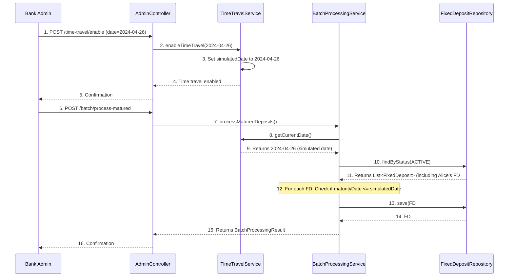

# Chapter 4: Time Travel & Batch Processing

Welcome back to the CashCached project! In the [previous chapter](03_fixed_deposit_core__fd_management__.md), we learned how to create and manage individual Fixed Deposit (FD) accounts for our customers. We saw how Alice could open an FD, and how the system calculates its maturity date and amount.

Now, imagine this scenario: a bank needs to test a new FD product that matures in 5 years. Do they have to wait 5 real years to see if it works correctly? Or what if a bank has thousands of FDs maturing every single day? Manually checking and updating each one would be impossible!

This is where the concepts of **Time Travel & Batch Processing** become incredibly powerful. They allow our `cashcached` application to simulate the passage of time and automate routine tasks, making testing faster and daily operations efficient.

## What are Time Travel & Batch Processing?

Think of `cashcached` as a miniature bank simulator.
*   **Time Travel** is like having a "fast-forward" button for this simulator. It lets you instantly jump to any date in the future (or even the past, though we'll focus on the future for FDs). This is not changing your computer's clock; it's changing the "current date" that *only our application* uses internally. This is invaluable for testing time-sensitive features without actually waiting.
*   **Batch Processing** is like putting the bank on "auto-pilot." Once we've set our simulated date (using Time Travel), batch processing steps in to automatically run all the scheduled daily or monthly tasks. This could be maturing FDs, calculating accrued interest, sending notifications, and more, all at once for many accounts.

Together, they provide a powerful toolkit for testing and automating the bank's time-sensitive operations.

## Our Central Use Case: Instantly Mature an FD for Testing

Let's revisit Alice's Fixed Deposit from [Chapter 3](03_fixed_deposit_core__fd_management__.md). Imagine she opened an FD with a 6-month tenure. We want to test if our system correctly matures this FD *right now*, without waiting 6 months.

Here’s our plan:
1.  **Create a short-term FD**: Alice opens an FD with a short tenure (e.g., 6 months).
2.  **"Time Travel" to the future**: We'll use the Time Travel feature to jump our application's internal clock 6 months forward to the FD's maturity date.
3.  **Run a Batch Job**: We'll trigger the "Process Matured FDs" batch job. This job will check all FDs against our *simulated* current date.
4.  **Verify Maturity**: We'll confirm that Alice's FD status has changed from `ACTIVE` to `MATURED`.

This demonstrates how we can accelerate testing for scenarios that would otherwise take months or years.

## Key Concepts

Let's break down these two powerful features:

| Concept         | What it Does                                          | Analogy                                   |
| :-------------- | :---------------------------------------------------- | :---------------------------------------- |
| **Time Travel** | Changes the application's internal "current date" for testing. | A fast-forward button for the bank's calendar. |
| **Batch Processing** | Automatically runs scheduled tasks for many FDs at once. | An auto-pilot for daily bank operations.   |

### 1. Time Travel: Manipulating the Calendar

The `TimeTravelService` is a special component that allows us to control what date the application considers "today."

*   **Enabling Time Travel (`enableTimeTravel(date)`)**: You can set a specific future date as the application's current date.
*   **Disabling Time Travel (`disableTimeTravel()`)**: This reverts the application to using the actual system date.
*   **Fast-Forwarding (`fastForward(days)`)**: You can advance the simulated date by a specific number of days. This is great for incremental testing.
*   **Getting Status (`getTimeTravelStatus()`)**: You can check if time travel is active and what the current simulated date is.

When time travel is enabled, any part of the application that asks "What is today's date?" will receive the simulated date instead of the real-world date.

### 2. Batch Processing: Automated Operations

The `BatchProcessingService` is responsible for performing bulk operations based on the current (real or simulated) date. It acts like an automated system administrator for FDs.

*   **Processing Matured Deposits (`processMaturedDeposits()`)**: This is a crucial job that scans all active FDs. If an FD's `maturityDate` is on or before the current simulated date, it automatically updates its `status` to `MATURED`.
*   **Processing Interest Accrual (`processInterestAccrual()`)**: For more complex FDs, this job would calculate and accrue interest over time. (In our simple simulator, interest is calculated upfront, but this placeholder demonstrates the concept).
*   **Finding FDs Nearing Maturity (`findFdsNearingMaturity(days)`)**: This utility helps identify FDs that will mature within a specified number of days, allowing the bank to proactively inform customers.
*   **Generating Summary Reports (`generateSummaryReport()`)**: This creates a snapshot of the FD portfolio based on the current date, showing counts of active, matured, closed FDs, and total amounts.

## Solving Our Use Case: Instantly Maturing Alice's FD

Let's walk through the steps to instantly mature Alice's 6-month FD using Time Travel and Batch Processing. These operations are typically performed by an `ADMIN` user.

### Step 1: Alice Creates a 6-Month FD

First, Alice, as a customer, opens a new Fixed Deposit. We'll assume the current date is `2023-10-26`.

```http
POST /api/customer/fixed-deposits
```

**Example Request Body (Input):**
```json
{
  "principalAmount": 5000.00,
  "interestRate": 4.50,
  "tenureInMonths": 6, // A short tenure for testing!
  "currency": "USD"
}
```

**What Happens (Output - simplified):**
The system creates her new FD. Its `maturityDate` will be approximately `2024-04-26` (6 months from now).

```json
{
  "id": 12346, // Let's assume this is the ID for this FD
  "principalAmount": 5000.00,
  "interestRate": 4.50,
  "tenureInMonths": 6,
  "status": "ACTIVE",
  "maturityAmount": 5112.50,
  "startDate": "2023-10-26T10:00:00",
  "maturityDate": "2024-04-26T10:00:00" // This is our target for time travel!
  // ... other details ...
}
```
*Explanation*: Alice now has an `ACTIVE` FD with a `maturityDate` in 6 months.

### Step 2: Admin Enables Time Travel and Fast Forwards

Now, an administrator will use the time travel feature to simulate being 6 months in the future.

```http
POST /api/admin/time-travel/enable?date=2024-04-26
```

**What Happens (Output):**
The application's internal clock is now `2024-04-26`.

```json
{
  "enabled": true,
  "simulatedDate": "2024-04-26",
  "message": "Time travel enabled. Current simulated date: 2024-04-26"
}
```
*Explanation*: The `cashcached` application now believes it is `2024-04-26`. Any new operations that rely on the "current date" will use this simulated date.

To confirm the status, the admin can check:
```http
GET /api/admin/time-travel/status
```

**What Happens (Output):**
```json
{
  "enabled": true,
  "currentDate": "2024-04-26",
  "simulatedDate": "2024-04-26",
  "realDate": "2023-10-26" // The actual calendar date remains unchanged
}
```
*Explanation*: The system clearly shows that time travel is `enabled` and the `currentDate` is the `simulatedDate`, not the `realDate`.

### Step 3: Admin Runs the "Process Matured Deposits" Batch Job

With the application's date now set to `2024-04-26`, the admin triggers the batch job to process matured FDs.

```http
POST /api/admin/batch/process-matured
```

**What Happens (Output):**
The system scans all active FDs. Since Alice's FD (`id: 12346`) has a `maturityDate` (`2024-04-26`) which is on or before the current simulated date, its status will be updated.

```json
{
  "processedCount": 1, // Alice's FD was processed
  "errorCount": 0,
  "totalAmount": 5112.50, // Her maturity amount
  "successful": true
}
```
*Explanation*: The batch job successfully identified and processed Alice's FD, changing its status to `MATURED`. In the background, the application console would also show logs confirming this action.

### Step 4: Verify FD Status

Finally, we confirm that Alice's FD has been correctly matured.

```http
GET /api/admin/fixed-deposits/12346
```

**What Happens (Output - simplified):**
The FD's status is now `MATURED`.

```json
{
  "id": 12346,
  "principalAmount": 5000.00,
  "interestRate": 4.50,
  "tenureInMonths": 6,
  "status": "MATURED", // SUCCESS!
  "maturityAmount": 5112.50,
  "startDate": "2023-10-26T10:00:00",
  "maturityDate": "2024-04-26T10:00:00"
  // ... other details ...
}
```
*Explanation*: We have successfully tested the maturity process for an FD that was originally set to mature in 6 months, all within a matter of seconds using Time Travel and Batch Processing!

To return to the real world:
```http
POST /api/admin/time-travel/disable
```

## Behind the Scenes: How It Works

Let's peek under the hood to see how Time Travel and Batch Processing are implemented in the `cashcached` project.

### Simplified Flow: Maturing an FD with Time Travel & Batch Processing


*Explanation*: The `AdminController` acts as the gatekeeper for these features. When time travel is enabled, the `TimeTravelService` updates an internal flag and stores the `simulatedDate`. Later, when the `BatchProcessingService` runs `processMaturedDeposits`, it asks `TimeTravelService` for the "current" date, which returns the simulated one. The batch service then queries the `FixedDepositRepository` for `ACTIVE` FDs and updates those whose `maturityDate` is due based on the *simulated* date.

### Database Structure

The `ER_DIAGRAM.md` file (our database blueprint) shows that the core of these features relies on the `FIXED_DEPOSITS` table, specifically the `status` and `maturity_date` columns.
*   **`FIXED_DEPOSITS`**: This table is where the `BatchProcessingService` fetches FDs to check their `maturity_date` and where it updates their `status` to `MATURED`.
*   **No new tables** are introduced for Time Travel itself; it's managed as an in-memory state within the `TimeTravelService`.

### Code References

Let's look at the simplified code snippets that bring these features to life.

#### The `AdminController` (`src/main/java/com/bank/fdsimulator/controller/AdminController.java`)

This controller exposes the API endpoints for administrators to control time travel and trigger batch jobs.

```java
// ... package and imports ...

@RestController
@RequestMapping("/api/admin")
// ...
public class AdminController {

    // ... other autowired services ...
    @Autowired
    private TimeTravelService timeTravelService;
    
    @Autowired
    private BatchProcessingService batchProcessingService;

    // ... user, FD, product management endpoints ...

    // ==================== Time Travel & Batch Processing ====================
    
    @PostMapping("/time-travel/enable")
    public ResponseEntity<Map<String, Object>> enableTimeTravel(@RequestParam String date) {
        LocalDate targetDate = LocalDate.parse(date);
        timeTravelService.enableTimeTravel(targetDate);
        // ... build and return response map ...
        return ResponseEntity.ok(response);
    }
    
    @PostMapping("/time-travel/disable")
    public ResponseEntity<Map<String, Object>> disableTimeTravel() {
        timeTravelService.disableTimeTravel();
        // ... build and return response map ...
        return ResponseEntity.ok(response);
    }
    
    @PostMapping("/time-travel/fast-forward")
    public ResponseEntity<Map<String, Object>> fastForward(@RequestParam int days) {
        timeTravelService.fastForward(days);
        // ... build and return response map ...
        return ResponseEntity.ok(response);
    }
    
    @GetMapping("/time-travel/status")
    public ResponseEntity<Map<String, Object>> getTimeTravelStatus() {
        Map<String, Object> response = new HashMap<>();
        response.put("enabled", timeTravelService.isTimeTravelEnabled());
        response.put("currentDate", timeTravelService.getCurrentDate());
        response.put("simulatedDate", timeTravelService.getSimulatedDate());
        response.put("realDate", LocalDate.now());
        return ResponseEntity.ok(response);
    }
    
    @PostMapping("/batch/process-matured")
    public ResponseEntity<Map<String, Object>> processMaturedDeposits() {
        var result = batchProcessingService.processMaturedDeposits();
        // ... build and return response map ...
        return ResponseEntity.ok(response);
    }
    
    // ... other batch processing endpoints ...
}
```
*Explanation*: The `AdminController` simply receives the requests from the admin user and delegates the actual work to the `TimeTravelService` or `BatchProcessingService`. It then formats their responses for the user. Notice how the `/time-travel/enable` endpoint takes a `date` parameter and `/batch/process-matured` has no parameters, as it operates based on the current (simulated) date.

#### The `TimeTravelService` (`src/main/java/com/bank/fdsimulator/service/TimeTravelService.java`)

This service holds the state for time travel and provides methods to interact with it.

```java
// ... package and imports ...
@Service
public class TimeTravelService {
    
    private LocalDate simulatedDate = null;
    private boolean timeTravelEnabled = false;
    
    public void enableTimeTravel(LocalDate date) {
        this.simulatedDate = date;
        this.timeTravelEnabled = true;
        System.out.println("⏰ TIME TRAVEL ENABLED: Simulated date set to " + date);
    }
    
    public void disableTimeTravel() {
        this.timeTravelEnabled = false;
        this.simulatedDate = null;
        System.out.println("⏰ TIME TRAVEL DISABLED: Using current date");
    }
    
    public LocalDate getCurrentDate() {
        // Returns simulated date if enabled, otherwise real current date
        return timeTravelEnabled && simulatedDate != null ? simulatedDate : LocalDate.now();
    }
    
    public void fastForward(int days) {
        if (!timeTravelEnabled) {
            enableTimeTravel(LocalDate.now()); // Enable if not already
        }
        simulatedDate = simulatedDate.plusDays(days);
        System.out.println("⏰ FAST FORWARD: Advanced " + days + " days to " + simulatedDate);
    }
    
    public boolean isTimeTravelEnabled() {
        return timeTravelEnabled;
    }
    // ... other methods ...
}
```
*Explanation*: This service is very simple: it stores the `simulatedDate` and a `timeTravelEnabled` flag. The most important method is `getCurrentDate()`, which checks if time travel is active and returns either the `simulatedDate` or the actual `LocalDate.now()`. This is the single source of truth for the application's "current date."

#### The `BatchProcessingService` (`src/main/java/com/bank/fdsimulator/service/BatchProcessingService.java`)

This service contains the logic for processing FDs in bulk.

```java
// ... package and imports ...
@Service
@Transactional // Ensures operations are treated as a single unit
public class BatchProcessingService {
    
    @Autowired
    private FixedDepositRepository fdRepository;
    
    @Autowired
    private TimeTravelService timeTravelService; // Crucially, uses TimeTravelService
    
    @Autowired
    private FixedDepositService fdService;
    
    public BatchProcessingResult processMaturedDeposits() {
        LocalDate currentDate = timeTravelService.getCurrentDate(); // Gets the simulated or real date
        List<FixedDeposit> activeFds = fdRepository.findByStatus(FdStatus.ACTIVE);
        
        int processedCount = 0;
        // ... initialization for errorCount, totalMaturedAmount ...
        
        for (FixedDeposit fd : activeFds) {
            try {
                // Check if FD's maturityDate is on or before the current date
                if (fd.getMaturityDate() != null && !fd.getMaturityDate().toLocalDate().isAfter(currentDate)) {
                    fd.setStatus(FdStatus.MATURED); // Update status
                    // Recalculate maturity amount (optional, but good practice)
                    BigDecimal maturityAmount = fdService.calculateMaturityAmount(
                        fd.getPrincipalAmount(), fd.getInterestRate(), fd.getTenureInMonths()
                    );
                    fd.setMaturityAmount(maturityAmount);
                    
                    fdRepository.save(fd); // Save the updated FD
                    processedCount++;
                    // ... update totalMaturedAmount ...
                    System.out.println("✓ Matured FD #" + fd.getId() + " - Amount: " + maturityAmount);
                }
            } catch (Exception e) {
                // ... error handling ...
            }
        }
        // ... return result ...
        return new BatchProcessingResult(processedCount, 0, BigDecimal.ZERO);
    }
    // ... other batch processing methods ...
}
```
*Explanation*: The `BatchProcessingService` gets the "current date" from the `TimeTravelService`. It then queries the `FixedDepositRepository` for all `ACTIVE` FDs. For each FD, it checks if its `maturityDate` is on or before the obtained `currentDate`. If so, it updates the FD's status to `MATURED` and saves the change back to the database. The `@Transactional` annotation ensures that these bulk updates are handled safely.

## Conclusion

In this chapter, we've explored the powerful concepts of **Time Travel & Batch Processing**. We learned how `Time Travel` allows us to instantly simulate future dates for testing time-sensitive scenarios, and how `Batch Processing` uses this simulated time to automatically run critical operations like maturing Fixed Deposits for many accounts at once. This combination is vital for both efficient development and robust real-world bank operations.

Now that we've seen how the core logic and powerful features work, it's time to understand how all these pieces are exposed to the outside world through the application's web interface.

[Next Chapter: RESTful API & Controllers](05_restful_api___controllers_.md)

---
 <sub><sup>**References**: [[1]](https://github.com/Arrowsincoming24/cashcached_final_integrated_repo/blob/72a6d5993708a94c0b2c9f66855bcf0f09b48506/API_ENDPOINTS.md), [[2]](https://github.com/Arrowsincoming24/cashcached_final_integrated_repo/blob/72a6d5993708a94c0b2c9f66855bcf0f09b48506/ENDPOINT_TEST_RESULTS.md), [[3]](https://github.com/Arrowsincoming24/cashcached_final_integrated_repo/blob/72a6d5993708a94c0b2c9f66855bcf0f09b48506/src/main/java/com/bank/fdsimulator/controller/AdminController.java), [[4]](https://github.com/Arrowsincoming24/cashcached_final_integrated_repo/blob/72a6d5993708a94c0b2c9f66855bcf0f09b48506/src/main/java/com/bank/fdsimulator/service/BatchProcessingService.java), [[5]](https://github.com/Arrowsincoming24/cashcached_final_integrated_repo/blob/72a6d5993708a94c0b2c9f66855bcf0f09b48506/src/main/java/com/bank/fdsimulator/service/TimeTravelService.java)</sup></sub>
