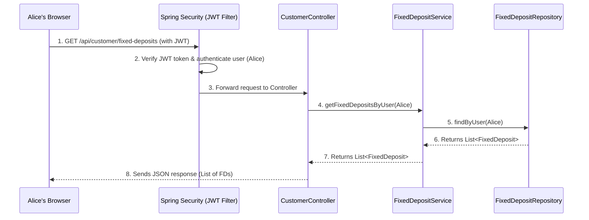

# Chapter 5: RESTful API & Controllers

Welcome back to the CashCached project! In our [previous chapter](04_time_travel___batch_processing_.md), we explored how our system can fast-forward time and automate tasks for Fixed Deposits (FDs). Before that, we learned about defining different FD products ([Chapter 1: FD Product Catalog](01_fd_product_catalog_.md)), managing users and their access ([Chapter 2: User & Authentication System](02_user___authentication_system_.md)), and handling individual FD accounts ([Chapter 3: Fixed Deposit Core (FD Management)](03_fixed_deposit_core__fd_management__.md)).

Now, all these amazing features are built into our backend system. But how do you actually *use* them? How does a customer's web browser, or an administrator's tool, tell our `cashcached` application to "create an FD" or "log me in"?

This is where the concept of **RESTful API & Controllers** comes in.

## What are RESTful API & Controllers?

Imagine our `cashcached` application is a bank building. All the services we've talked about – product catalog, user authentication, FD management, time travel – are like the different departments and operations happening *inside* the bank.

But the outside world (you, the customer; or an admin) can't just directly walk into the vault! You interact with the bank through specific points:
*   **The teller at the front desk:** You tell them, "I want to open an FD" or "What's my balance?"
*   **The loan officer:** You tell them, "I need to apply for a loan."
*   **The bank manager:** You tell them, "I want to introduce a new product."

These "front desks" are the **Controllers** in our application. They are the direct communication interface, receiving requests from you, understanding what you want, directing your request to the correct internal department (our services), and then sending back a structured response.

The **RESTful API** is the *language* and *rules* you use to talk to these controllers. It defines *how* you ask for things (e.g., "use this specific URL," "send data in this format," "use this verb to describe my action").

Together, they allow different parts of the system (like a web user interface, a mobile app, or even another computer program) to "talk" to our `cashcached` backend logic in a standardized and efficient way.

## Our Central Use Case: A Customer Views Their Fixed Deposits

Let's revisit Alice, our customer from [Chapter 2: User & Authentication System](02_user___authentication_system_.md). She has logged in and wants to see a list of all her Fixed Deposits.

Here's how this interaction typically happens:
1.  **Alice's Browser:** Alice clicks a button on her dashboard that says "View My FDs."
2.  **Request Sent:** Her browser sends a message to the `cashcached` backend saying, "Hey, show me all the FDs for the currently logged-in user."
3.  **Controller Receives:** A specific "front desk" (a **Controller**) in our backend receives this message.
4.  **Processing:** The controller verifies Alice's identity, asks the `FixedDepositService` (the "FD Management Department") to fetch her FDs.
5.  **Response Sent:** The controller gets the list of FDs from the service and sends it back to Alice's browser in a readable format.

This entire interaction is facilitated by the RESTful API and handled by a Controller.

## Key Concepts of RESTful API & Controllers

Let's break down the main ideas that make up this communication layer:

| Concept         | What it Does                                          | Analogy                                     |
| :-------------- | :---------------------------------------------------- | :------------------------------------------ |
| **API**         | Defines how software components talk to each other.   | A bank's rulebook for customer interactions. |
| **REST**        | A popular style for building APIs, using standard HTTP methods and URLs. | A specific, well-understood way to follow the bank's rulebook. |
| **Endpoint**    | A specific URL for a particular action or resource.   | A specific window or counter at the bank (e.g., "FD Enquiries"). |
| **HTTP Methods**| "Verbs" that define the type of action (GET, POST, PUT, DELETE). | What you *do* at the window: ask (GET), submit (POST), change (PUT), cancel (DELETE). |
| **Controller**  | Receives incoming requests, directs them, and sends responses. | The bank teller or officer at the front desk. |
| **Request**     | The message sent from the client (e.g., browser) to the server. | What you tell the teller.                   |
| **Response**    | The message sent back from the server to the client.  | What the teller tells you back (e.g., your FD list). |

### 1. API & REST (The Language and Rules)

An **API (Application Programming Interface)** is simply a set of rules that allow different software programs to communicate. **REST (Representational State Transfer)** is a widely used architectural style for designing APIs, especially for web services. RESTful APIs use standard web protocols (like HTTP) and URLs to interact with resources (like an FD, a user, or a product). They are stateless, meaning each request from a client to the server contains all the information needed to understand the request, and the server doesn't "remember" previous requests.

### 2. Endpoints (The Specific Locations)

An **endpoint** is like a specific address (a URL) for a particular operation. For example:
*   `/api/customer/fixed-deposits` might be the endpoint to get a customer's FDs.
*   `/api/admin/products` might be for managing FD products.
*   `/api/auth/login` is for logging in.

These endpoints are organized to be logical and easy to understand.

### 3. HTTP Methods (The Actions)

HTTP methods are the "verbs" you use when making a request to an endpoint. The most common ones are:
*   **GET:** Request to *read* data (e.g., "Get me all my FDs").
*   **POST:** Request to *create* new data (e.g., "Create a new FD for me").
*   **PUT:** Request to *update* existing data (e.g., "Update the details of this specific FD").
*   **DELETE:** Request to *remove* data (e.g., "Delete this FD").
*   **PATCH:** Request to *partially update* existing data (e.g., "Change only the status of this FD").

### 4. Controller (The Front Desk)

In our Java Spring Boot application, a **Controller** is a special class that handles incoming web requests. It has methods that match specific HTTP methods and endpoints. When a request comes in, the appropriate controller method is called. This method then usually:
1.  Takes information from the request (like the customer's ID or the FD details).
2.  Calls one or more "service" classes (like `FixedDepositService` or `UserService`) to do the actual work.
3.  Receives the result from the service.
4.  Formats a **response** (often as JSON, a standard data format) and sends it back to the client.

## Solving Our Use Case: Alice Views Her Fixed Deposits

Let's see how Alice's request to view her FDs is handled by the RESTful API and a Controller.

### Step 1: Alice's Browser Sends a Request

When Alice (who is logged in, as per [Chapter 2](02_user___authentication_system_.md)) clicks "View My FDs," her browser sends an HTTP GET request to our `cashcached` backend. Because she's logged in, her browser also includes her **security token** (JWT) in the request header, proving her identity.

```http
GET /api/customer/fixed-deposits
Authorization: Bearer <Alice's_JWT_Token>
```

**What Happens (Output - high level):**
Alice's request travels over the internet to our `cashcached` server. The server's network layer passes it to our Spring Boot application.

### Step 2: The `CustomerController` Receives and Processes

Inside our application, the `CustomerController` (which is like the "front desk for customers") has a specific method designed to handle `GET` requests to `/api/customer/fixed-deposits`.

```java
// Simplified Controller method
// This method is in src/main/java/com/bank/fdsimulator/controller/CustomerController.java
@GetMapping("/fixed-deposits")
public ResponseEntity<?> getMyFixedDeposits(Authentication authentication) {
    // 1. Get the logged-in user's information from the security token
    User user = (User) authentication.getPrincipal(); 

    // 2. Call the FixedDepositService (the "FD Management Department")
    //    to get all FDs for this specific user.
    List<FixedDeposit> fds = fdService.getFixedDepositsByUser(user); 

    // 3. Prepare the response: send back the list of FDs.
    return ResponseEntity.ok(fds); 
}
```
*Explanation*:
1.  `@GetMapping("/fixed-deposits")` tells Spring, "Hey, if you get a `GET` request for `/api/customer/fixed-deposits`, send it to this method."
2.  `Authentication authentication` automatically provides information about the logged-in user (Alice), thanks to our [User & Authentication System](02_user___authentication_system_.md).
3.  `fdService.getFixedDepositsByUser(user)` is where the controller delegates the actual work to the `FixedDepositService` (which we saw in [Chapter 3](03_fixed_deposit_core__fd_management__.md)).
4.  `ResponseEntity.ok(fds)` packages the list of FDs into a standard HTTP response with a "200 OK" status code and sends it back.

### Step 3: Alice's Browser Receives the Response

The `CustomerController` sends back a response. This response is usually in **JSON (JavaScript Object Notation)** format, which is a lightweight and human-readable way to represent data.

```json
[
  {
    "id": 12345,
    "principalAmount": 5000.00,
    "interestRate": 4.50,
    "tenureInMonths": 24,
    "status": "ACTIVE",
    "maturityAmount": 5450.00,
    "startDate": "2023-10-26T10:00:00",
    "maturityDate": "2025-10-26T10:00:00"
  },
  {
    "id": 12346,
    "principalAmount": 10000.00,
    "interestRate": 5.00,
    "tenureInMonths": 12,
    "status": "MATURED",
    "maturityAmount": 10500.00,
    "startDate": "2022-05-15T09:30:00",
    "maturityDate": "2023-05-15T09:30:00"
  }
]
```
*Explanation*: Alice's browser receives this JSON data. It then uses this information to display a beautiful, easy-to-read list of her FDs on her dashboard!

## Behind the Scenes: How a Request Flows

Let's look at the simplified path a request takes from Alice's browser to our database and back.

### Simplified Request-Response Flow


*Explanation*:
1.  Alice's browser sends the `GET` request, including her JWT token, to `/api/customer/fixed-deposits`.
2.  `Spring Security` (specifically the `JwtAuthenticationFilter` from [Chapter 2](02_user___authentication_system_.md)) intercepts the request, verifies Alice's token, and confirms she is a valid, authenticated user.
3.  The request is then passed to the `CustomerController`.
4.  The `CustomerController` calls the `FixedDepositService` to get Alice's FDs.
5.  The `FixedDepositService` then uses the `FixedDepositRepository` (which connects to the database, as we'll see in [Chapter 6: Data Persistence Layer](06_data_persistence_layer_.md)) to retrieve the actual FD records.
6.  The data flows back up the chain: Repository -> Service -> Controller.
7.  Finally, the `CustomerController` formats the data as JSON and sends it back to Alice's browser.

### Code References

Let's look at the actual code for the controllers.

#### The `CustomerController` (`src/main/java/com/bank/fdsimulator/controller/CustomerController.java`)

This class handles all API requests made by a `CUSTOMER` role.

```java
package com.bank.fdsimulator.controller;

// ... other imports ...
import com.bank.fdsimulator.entity.User;
import com.bank.fdsimulator.service.FixedDepositService;
import org.springframework.beans.factory.annotation.Autowired;
import org.springframework.http.ResponseEntity;
import org.springframework.security.core.Authentication; // Key for getting user info
import org.springframework.web.bind.annotation.*; // For annotations like @RestController, @RequestMapping

import java.util.List;

@RestController // Marks this class as a REST controller
@RequestMapping("/api/customer") // All endpoints in this controller start with /api/customer
@CrossOrigin(origins = "*") // Allows web browsers from other domains to access (for frontend)
public class CustomerController {

    @Autowired // Automatically connects the FixedDepositService
    private FixedDepositService fdService; 
    
    // ... other autowired services ...

    // Handles POST requests to /api/customer/fixed-deposits for creating an FD
    @PostMapping("/fixed-deposits")
    public ResponseEntity<FixedDeposit> createFixedDeposit(@RequestBody FdCreateRequest request,
                                                          Authentication authentication) {
        User user = (User) authentication.getPrincipal(); // Get current logged-in user
        // ... (call fdService to create FD) ...
        return ResponseEntity.ok(fd);
    }
    
    // Handles GET requests to /api/customer/fixed-deposits for viewing FDs
    @GetMapping("/fixed-deposits")
    public ResponseEntity<?> getMyFixedDeposits(Authentication authentication) {
        User user = (User) authentication.getPrincipal(); // Get current logged-in user
        List<FixedDeposit> fds = fdService.getFixedDepositsByUser(user); // Fetch FDs from service
        return ResponseEntity.ok(fds); // Return as HTTP 200 OK
    }
    
    // ... other customer-specific endpoints ...
}
```
*Explanation*:
*   `@RestController`: This annotation tells Spring that this class is a controller for handling RESTful web requests. It automatically converts method return values into JSON.
*   `@RequestMapping("/api/customer")`: This sets the base URL for all methods in this controller. So, the `getMyFixedDeposits` method (with `@GetMapping("/fixed-deposits")`) will respond to requests at `/api/customer/fixed-deposits`.
*   `@Autowired`: Spring automatically finds and "injects" an instance of `FixedDepositService` into this controller, so we can use its methods (`fdService.getFixedDepositsByUser()`).
*   `Authentication authentication`: This is a powerful feature from Spring Security. When a request comes in with a valid JWT token, Spring Security extracts the user's information and makes it available through this `Authentication` object, so the controller knows *who* is making the request.
*   `ResponseEntity<?>`: This is a flexible class from Spring that represents the entire HTTP response, including the status code (e.g., 200 OK, 404 Not Found) and the body of the response (our JSON data).

#### The `AdminController` (`src/main/java/com/bank/fdsimulator/controller/AdminController.java`)

Similarly, the `AdminController` handles requests specific to administrators, like managing products or time travel.

```java
package com.bank.fdsimulator.controller;

// ... imports ...
import com.bank.fdsimulator.entity.FdProduct.ProductStatus;
import com.bank.fdsimulator.service.BatchProcessingService;
import com.bank.fdsimulator.service.TimeTravelService;
import org.springframework.http.ResponseEntity;
import org.springframework.security.core.Authentication;
import org.springframework.web.bind.annotation.*;
import java.time.LocalDate;
import java.util.Map;

@RestController
@RequestMapping("/api/admin") // All endpoints here start with /api/admin
public class AdminController {

    @Autowired private TimeTravelService timeTravelService;
    @Autowired private BatchProcessingService batchProcessingService;

    // Handles POST requests to /api/admin/time-travel/enable
    @PostMapping("/time-travel/enable")
    public ResponseEntity<Map<String, Object>> enableTimeTravel(@RequestParam String date) {
        LocalDate targetDate = LocalDate.parse(date);
        timeTravelService.enableTimeTravel(targetDate); // Call the TimeTravelService
        // ... build and return response ...
        return ResponseEntity.ok(response);
    }
    
    // Handles POST requests to /api/admin/batch/process-matured
    @PostMapping("/batch/process-matured")
    public ResponseEntity<Map<String, Object>> processMaturedDeposits() {
        var result = batchProcessingService.processMaturedDeposits(); // Call BatchProcessingService
        // ... build and return response ...
        return ResponseEntity.ok(response);
    }

    // ... other admin-specific endpoints ...
}
```
*Explanation*: The `AdminController` works just like the `CustomerController`, but it exposes different functionalities (`TimeTravelService`, `BatchProcessingService`) under the `/api/admin` base path. Notice how `@RequestParam String date` captures a parameter from the URL (e.g., `?date=2025-12-31`).

#### The `AuthController` (`src/main/java/com/bank/fdsimulator/controller/AuthController.java`)

This controller is responsible for user registration and login.

```java
package com.bank.fdsimulator.controller;

// ... imports ...
import com.bank.fdsimulator.dto.LoginRequest;
import com.bank.fdsimulator.dto.LoginResponse;
import com.bank.fdsimulator.service.UserService;
import org.springframework.http.ResponseEntity;
import org.springframework.web.bind.annotation.*;
import jakarta.validation.Valid;

@RestController
@RequestMapping("/api/auth") // All authentication endpoints start here
public class AuthController {

    @Autowired private UserService userService;
    // ... other autowired services ...

    @PostMapping("/register") // For /api/auth/register (create new user)
    public ResponseEntity<?> register(@Valid @RequestBody RegisterRequest request) {
        // ... (logic to create user via userService) ...
        return ResponseEntity.ok(response);
    }

    @PostMapping("/login") // For /api/auth/login
    public ResponseEntity<?> login(@Valid @RequestBody LoginRequest request) {
        // ... (logic to authenticate user and generate JWT token) ...
        return ResponseEntity.ok(response);
    }
    // ... other auth endpoints like /send-otp, /verify-otp, /logout ...
}
```
*Explanation*: This controller manages users signing up (`/register`) and logging in (`/login`). `@RequestBody` tells Spring to take the entire JSON body of the incoming request and convert it into a Java object (`RegisterRequest` or `LoginRequest`). `@Valid` ensures that the data in the request body meets certain rules (e.g., email format, password strength).

## Conclusion

In this chapter, we've demystified **RESTful API & Controllers**. We learned that controllers act as the "front desks" of our `cashcached` application, handling incoming requests using a standardized language called REST. We explored how HTTP methods (like GET, POST) and specific endpoints direct these requests to the right controller methods, which then delegate work to our services and send back structured JSON responses. This communication layer is essential for any external system (like a web browser or mobile app) to interact with our backend's powerful features.

Now that we understand how requests come in and responses go out, the final piece of the puzzle is to understand where all our data actually lives and how it's stored and retrieved.

[Next Chapter: Data Persistence Layer](06_data_persistence_layer_.md)

--- <sub><sup>**References**: [[1]](https://github.com/Arrowsincoming24/cashcached_final_integrated_repo/blob/72a6d5993708a94c0b2c9f66855bcf0f09b48506/API_ENDPOINTS.md), [[2]](https://github.com/Arrowsincoming24/cashcached_final_integrated_repo/blob/72a6d5993708a94c0b2c9f66855bcf0f09b48506/ENDPOINT_TEST_RESULTS.md), [[3]](https://github.com/Arrowsincoming24/cashcached_final_integrated_repo/blob/72a6d5993708a94c0b2c9f66855bcf0f09b48506/SWAGGER_GUIDE.md), [[4]](https://github.com/Arrowsincoming24/cashcached_final_integrated_repo/blob/72a6d5993708a94c0b2c9f66855bcf0f09b48506/src/main/java/com/bank/fdsimulator/controller/AdminController.java), [[5]](https://github.com/Arrowsincoming24/cashcached_final_integrated_repo/blob/72a6d5993708a94c0b2c9f66855bcf0f09b48506/src/main/java/com/bank/fdsimulator/controller/AuthController.java), [[6]](https://github.com/Arrowsincoming24/cashcached_final_integrated_repo/blob/72a6d5993708a94c0b2c9f66855bcf0f09b48506/src/main/java/com/bank/fdsimulator/controller/CustomerController.java), [[7]](https://github.com/Arrowsincoming24/cashcached_final_integrated_repo/blob/72a6d5993708a94c0b2c9f66855bcf0f09b48506/src/main/java/com/bank/fdsimulator/controller/PublicController.java)</sup></sub>
