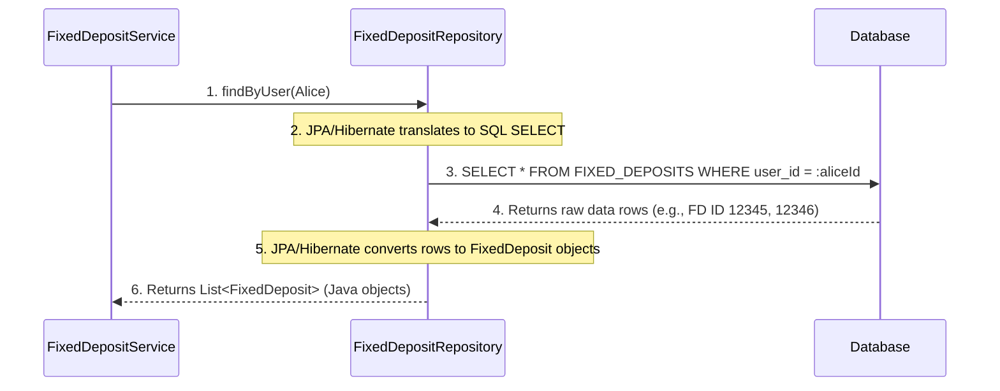

# Chapter 6: Data Persistence Layer

Welcome back to the CashCached project! In our [previous chapter](05_restful_api___controllers_.md), we learned how **RESTful APIs and Controllers** act as the "front desk" of our application, allowing customers and administrators to communicate with our system. We saw how Alice's request to view her Fixed Deposits (FDs) reaches the `CustomerController`, which then asks the `FixedDepositService` for the data.

But where does the `FixedDepositService` *get* that data from? If the server turns off, do we lose all of Alice's FDs, all the FD products, and all user accounts? Absolutely not! That would be a very bad bank!

This is where the **Data Persistence Layer** comes into play.

## What is the Data Persistence Layer?

Imagine a bank's **secure vault and meticulous record-keeping system**. All customer account details, every Fixed Deposit certificate, every product offering, and every transaction must be stored safely and reliably, even if the power goes out or the bank closes for the night. This is exactly what the **Data Persistence Layer** does for our `cashcached` application.

This layer is responsible for:
*   **Storing all the application's data** in a database (like placing records in the vault).
*   **Retrieving data** when the application needs it (like fetching a specific record from the vault).
*   **Ensuring data is saved reliably** and consistently.

It acts as the crucial bridge between the application's "objects" (like a `User` or a `FixedDeposit` in our Java code) and their representation in tables within a database.

## Our Central Use Case: Storing and Retrieving Alice's FD

Let's revisit Alice from previous chapters. When she opens a new FD, the system needs to **store** that FD safely. When she later wants to *view* her FDs, the system needs to **retrieve** them from storage.

This chapter will show you:
1.  How our Java objects (`User`, `FixedDeposit`, `FdProduct`) are defined to match database tables.
2.  How we use special components called "Repositories" to perform standard database operations like saving and fetching data.

## Key Concepts of the Data Persistence Layer

To understand how our application securely stores and retrieves data, let's break down the main ideas:

| Concept                | What it Does                                        | Analogy                                   |
| :--------------------- | :-------------------------------------------------- | :---------------------------------------- |
| **Database**           | The actual secure storage location for all data.    | The bank's physical vault & record room.  |
| **Entity**             | A Java class that represents a table in the database. | A blueprint for a record card (e.g., "User Card"). |
| **Repository**         | A special component that handles database operations (CRUD). | The bank clerk who knows exactly how to fill out, find, or update a specific type of record card. |
| **JPA / Hibernate**    | The tools that translate Java objects to database entries and back. | The specialized filing system and language the clerk uses to interact with the vault. |

### 1. Database (The Vault)

At the very bottom of our system is the **Database**. This is where all the actual information (`Users`, `FixedDeposits`, `FdProducts`, etc.) resides. Our `cashcached` project uses an H2 database for development (a simple, file-based database) and can easily be configured to use a more robust database like MySQL for production.

### 2. Entity (The Record Card Blueprint)

In our Java code, we have classes like `User`, `FixedDeposit`, and `FdProduct`. These classes are called **Entities** because they represent real-world "things" that we want to store in our database. Each Entity class is designed to map directly to a table in the database.

For example, our `User` entity might have fields like `id`, `username`, `email`, `password`, which correspond to columns in a `USERS` table in the database.

### 3. Repository (The Specialized Clerk)

A **Repository** is an interface (a contract) that defines a set of methods for performing common database operations on a specific Entity. Think of it as a specialized bank clerk trained for one type of record card.
*   **`UserRepository`**: Knows how to find, save, or delete `User` records.
*   **`FixedDepositRepository`**: Knows how to find, save, or delete `FixedDeposit` records.
*   **`FdProductRepository`**: Knows how to find, save, or delete `FdProduct` records.

These repositories provide standard operations like:
*   `save(entity)`: Create or update a record.
*   `findById(id)`: Read a record by its unique ID.
*   `delete(entity)`: Delete a record.
*   `findAll()`: Read all records of that type.
*   Custom methods like `findByUsername(username)` or `findByUser(user)`.

The beauty of Spring Data JPA (which we use) is that we often just need to *define* these interfaces, and Spring automatically provides the actual implementation code for us!

### 4. JPA / Hibernate (The Filing System)

**JPA (Java Persistence API)** is a standard specification for managing relational data in Java applications. **Hibernate** is a popular *implementation* of the JPA standard.

These tools handle the complex task of:
*   Converting a Java `FixedDeposit` object into a row in the `FIXED_DEPOSITS` table.
*   Converting a row from the `FIXED_DEPOSITS` table back into a Java `FixedDeposit` object.
*   Generating the necessary SQL queries (like `SELECT`, `INSERT`, `UPDATE`, `DELETE`) behind the scenes, so our Java code doesn't have to write raw SQL.

## Solving Our Use Case: Retrieving Alice's FDs

Let's look at the flow for Alice viewing her FDs, focusing on the persistence layer. We already saw in [Chapter 5: RESTful API & Controllers](05_restful_api___controllers_.md) how her request reaches the `FixedDepositService`. Now, we'll see how the service uses the persistence layer.

### Step 1: Alice's Request (from Chapter 5)

Alice's browser sends a `GET` request:

```http
GET /api/customer/fixed-deposits
Authorization: Bearer <Alice's_JWT_Token>
```

This request is handled by the `CustomerController`, which then calls the `FixedDepositService`.

### Step 2: The `FixedDepositService` Uses the Repository

Inside the `FixedDepositService`, when asked for Alice's FDs, it doesn't try to talk directly to the database. Instead, it asks the `FixedDepositRepository` (its specialized clerk): "Please give me all Fixed Deposits for this `User` (Alice)."

```java
// Simplified FixedDepositService method (from Chapter 3)
// This method is in src/main/java/com/bank/fdsimulator/service/FixedDepositService.java
// ...
@Autowired
private FixedDepositRepository fdRepository; // The specialized clerk

public List<FixedDeposit> getFixedDepositsByUser(User user) {
    // fdRepository acts as the bridge to the database.
    // It knows how to find FixedDeposit records associated with a specific User.
    List<FixedDeposit> fds = fdRepository.findByUser(user); 
    return fds;
}
// ...
```
*Explanation*: The `FixedDepositService` receives the `User` object for Alice. It then uses `fdRepository.findByUser(user)` to fetch all `FixedDeposit` entities that are linked to Alice. The `FixedDepositRepository` (behind the scenes, with JPA/Hibernate) translates this into a database query, fetches the data, and converts it back into a list of `FixedDeposit` Java objects.

### Step 3: Database Returns Data

The database, in turn, finds the rows in the `FIXED_DEPOSITS` table that belong to Alice and sends them back. These rows are then converted into `FixedDeposit` Java objects by JPA/Hibernate and returned to the `FixedDepositService`, which then sends them back to the `CustomerController`, and finally to Alice's browser as a JSON response.

## Behind the Scenes: How Data Moves

Let's look at the simplified flow of data when the `FixedDepositService` asks for Alice's FDs.

### Simplified Data Retrieval Flow


*Explanation*:
1.  The `FixedDepositService` calls a method on the `FixedDepositRepository`.
2.  The `FixedDepositRepository` (powered by JPA/Hibernate) translates this Java method call into a SQL query.
3.  This SQL query is sent to the `Database`.
4.  The `Database` executes the query and sends back the raw data (rows and columns).
5.  JPA/Hibernate takes this raw data and converts it back into proper Java `FixedDeposit` objects.
6.  The `FixedDepositRepository` returns these Java objects to the `FixedDepositService`.

### Database Structure

The `ER_DIAGRAM.md` file (our database blueprint) gives us a visual representation of how our data is structured in the database.

*   **`USERS`**: This table stores details about each user, like `id`, `username`, `email`, `password`, and `role`. Each row in this table corresponds to a `User` entity in our Java code.
*   **`FD_PRODUCTS`**: This table stores information about each Fixed Deposit product, like `id`, `product_name`, `min_amount`, `max_amount`, etc. This maps to our `FdProduct` entity.
*   **`FIXED_DEPOSITS`**: This crucial table stores each individual Fixed Deposit opened by a customer. It has columns like `id`, `principal_amount`, `interest_rate`, `tenure_months`, `status`, `start_date`, `maturity_date`, and `maturity_amount`.
    *   It also has `user_id` which is a **Foreign Key** linking it to the `USERS` table, telling us which user owns this FD.
    *   Similarly, `product_id` links it to the `FD_PRODUCTS` table, telling us which product definition this FD is based on.

These tables store all the information that our application's services (like `FixedDepositService` or `UserService`) need to do their work.

### Code References

Let's look at the simplified code that makes this persistence layer work.

#### The `User` Entity (`src/main/java/com/bank/fdsimulator/entity/User.java`)

This Java class is the blueprint for how `User` information is mapped to the `USERS` table.

```java
// ... package and imports ...
import jakarta.persistence.*; // Important JPA annotations

@Entity // Marks this class as a database entity
@Table(name = "users") // Specifies the actual table name in the DB
public class User {

    @Id // Marks this as the primary key
    @GeneratedValue(strategy = GenerationType.IDENTITY) // Database generates ID automatically
    private Long id; // Unique ID for each user

    @Column(unique = true, nullable = false) // Defines column properties (unique, cannot be empty)
    private String username;

    @Column(unique = true, nullable = false)
    private String email;

    // ... other fields like password, role, phoneNumber ...

    // ... getters, setters, constructors ...
}
```
*Explanation*:
*   `@Entity`: Tells JPA/Hibernate that this `User` class should be mapped to a database table.
*   `@Table(name = "users")`: Explicitly names the database table as `users`.
*   `@Id`: Marks the `id` field as the primary key of the table.
*   `@GeneratedValue(strategy = GenerationType.IDENTITY)`: Configures the database to automatically create a unique ID for each new `User` (like an auto-incrementing number).
*   `@Column`: Provides additional details about how a field maps to a column (e.g., `unique = true` means no two users can have the same username).

#### The `FixedDeposit` Entity (`src/main/java/com/bank/fdsimulator/entity/FixedDeposit.java`)

This entity maps to the `FIXED_DEPOSITS` table and shows how relationships are defined.

```java
// ... package and imports ...
import jakarta.persistence.*;
import java.math.BigDecimal;
import java.time.LocalDateTime;

@Entity
@Table(name = "fixed_deposits")
public class FixedDeposit {

    @Id
    @GeneratedValue(strategy = GenerationType.IDENTITY)
    private Long id;

    @ManyToOne(fetch = FetchType.LAZY) // Many FDs can belong to One User
    @JoinColumn(name = "user_id", nullable = false) // The foreign key column in FIXED_DEPOSITS table
    private User user; // Link to the customer who owns this FD

    @ManyToOne(fetch = FetchType.LAZY) // Many FDs can be based on One FdProduct
    @JoinColumn(name = "product_id") // The foreign key column
    private FdProduct product; // Link to the FD product from catalog

    private BigDecimal principalAmount;
    private Integer tenureInMonths;
    // ... other fields like interestRate, status, maturityAmount, startDate, maturityDate ...

    // ... getters, setters, constructors ...
}
```
*Explanation*:
*   `@ManyToOne`: This annotation defines a "many-to-one" relationship. For example, *many* `FixedDeposit` entities can be associated with *one* `User` entity.
*   `@JoinColumn(name = "user_id", nullable = false)`: Specifies the foreign key column (`user_id`) in the `FIXED_DEPOSITS` table that links back to the `USERS` table. `nullable = false` means an FD *must* have an owner.
*   `fetch = FetchType.LAZY`: This is an optimization. It means that when you load a `FixedDeposit`, the `User` object it's linked to won't be loaded from the database immediately. It will only be loaded if your code actually tries to access `fd.getUser()`.

#### The `FixedDepositRepository` (`src/main/java/com/bank/fdsimulator/repository/FixedDepositRepository.java`)

This is the interface that acts as the "specialized clerk" for `FixedDeposit` data.

```java
// ... package and imports ...
import com.bank.fdsimulator.entity.FixedDeposit;
import com.bank.fdsimulator.entity.User;
import org.springframework.data.jpa.repository.JpaRepository; // Key Spring Data JPA interface
import org.springframework.stereotype.Repository;

import java.util.List;

@Repository // Marks this interface as a Spring Data JPA Repository
public interface FixedDepositRepository extends JpaRepository<FixedDeposit, Long> {
    
    // Spring Data JPA automatically provides implementation for this method!
    List<FixedDeposit> findByUser(User user); 
    
    // Another example: find FDs by user and their status
    List<FixedDeposit> findByUserAndStatus(User user, FdStatus status);
    
    // We can also define custom queries using JPQL (Java Persistence Query Language)
    @Query("SELECT fd FROM FixedDeposit fd WHERE fd.maturityDate <= :currentDate AND fd.status = 'ACTIVE'")
    List<FixedDeposit> findMaturedFds(@Param("currentDate") LocalDateTime currentDate);
    
    // ... other query methods ...
}
```
*Explanation*:
*   `@Repository`: Tells Spring that this interface is a repository component and should be scanned.
*   `extends JpaRepository<FixedDeposit, Long>`: This is the magic! By extending `JpaRepository`, our `FixedDepositRepository` automatically inherits a ton of standard database operations for the `FixedDeposit` entity (like `save`, `findById`, `findAll`, `delete`). The `Long` specifies the type of the primary key (`id` in `FixedDeposit`).
*   `List<FixedDeposit> findByUser(User user);`: This is a "derived query" method. Spring Data JPA is smart enough to see `findByUser` and automatically generate the SQL query to find FDs where the `user` column matches the provided `User` object! We don't write any SQL.
*   `@Query`: If the method name isn't enough for a complex query, you can write a custom query using JPQL (which is similar to SQL but uses Java entity and field names).

#### The `UserRepository` (`src/main/java/com/bank/fdsimulator/repository/UserRepository.java`)

This works similarly for `User` entities.

```java
// ... package and imports ...
import com.bank.fdsimulator.entity.User;
import org.springframework.data.jpa.repository.JpaRepository;
import org.springframework.stereotype.Repository;

import java.util.Optional;

@Repository
public interface UserRepository extends JpaRepository<User, Long> {
    
    Optional<User> findByUsername(String username); // Find a user by their username
    Optional<User> findByEmail(String email);       // Find a user by their email
    boolean existsByUsername(String username);      // Check if a username already exists
    
    // ... other methods ...
}
```
*Explanation*: Just like `FixedDepositRepository`, this interface extends `JpaRepository` to get all basic CRUD operations for `User` objects. It also has derived query methods like `findByUsername` and `existsByUsername`. `Optional` is used for methods that might not find a matching record, helping to prevent `NullPointerExceptions`.

#### `application.yml` (Database Configuration)

This configuration file (`src/main/resources/application.yml`) tells Spring Boot how to connect to our database.

```yaml
# ... other configurations ...

spring:
  # ... other spring properties ...
  
  datasource: # This section configures our database connection
    url: jdbc:h2:file:./data/fddb;DB_CLOSE_ON_EXIT=FALSE;AUTO_RECONNECT=TRUE # Connection URL for H2 file database
    driver-class-name: org.h2.Driver # Driver for H2
    username: sa # Database username
    password: sa # Database password
  
  h2: # Configuration for the H2 database console (for viewing data)
    console:
      enabled: true
      path: /h2-console
      settings:
        web-allow-others: true
  
  jpa: # Java Persistence API (JPA) configuration
    hibernate:
      ddl-auto: update # Hibernate will update database schema automatically
    show-sql: true # Show the SQL queries Hibernate generates (useful for debugging)
    properties:
      hibernate:
        '[format_sql]': true
        dialect: org.hibernate.dialect.H2Dialect # Tells Hibernate we're using H2
        jdbc:
          '[time_zone]': UTC # Time zone for database operations
```
*Explanation*:
*   `spring.datasource`: This block specifies all the necessary details for Spring to connect to our H2 database. It includes the connection `url`, the database `driver`, and the `username`/`password`.
*   `spring.h2.console`: This enables a web-based console (accessible at `/h2-console` when the app is running) where you can browse the database tables and data directly.
*   `spring.jpa.hibernate.ddl-auto: update`: This tells Hibernate to automatically compare our Java `@Entity` classes with the database schema. If there are any differences (e.g., a new field in an Entity), it will try to `update` the database table to match. (For production, this is often set to `none` or `validate` and managed with dedicated migration tools.)
*   `spring.jpa.show-sql: true`: This is super helpful for developers! It makes Hibernate print out all the SQL queries it generates to the console, so you can see exactly what's happening under the hood.

## Conclusion

In this chapter, we've gone into the **secure vault** of our `cashcached` application: the **Data Persistence Layer**. We learned that this layer is responsible for reliably storing and retrieving all our application's data in a **Database**. We explored how Java **Entities** (like `User` and `FixedDeposit`) are blueprints for database tables, and how **Repositories** act as specialized data managers, using **JPA/Hibernate** to seamlessly translate between Java objects and database records. This robust layer ensures that all the bank's vital information is safely kept and readily available, even across restarts.

This chapter concludes our journey through the core components of the `cashcached` project. From defining FD products to managing users, simulating time, exposing APIs, and finally persisting all the data, you now have a comprehensive understanding of how our banking simulator works!

---
 <sub><sup>**References**: [[1]](https://github.com/Arrowsincoming24/cashcached_final_integrated_repo/blob/72a6d5993708a94c0b2c9f66855bcf0f09b48506/ER_DIAGRAM.md), [[2]](https://github.com/Arrowsincoming24/cashcached_final_integrated_repo/blob/72a6d5993708a94c0b2c9f66855bcf0f09b48506/src/main/java/com/bank/fdsimulator/repository/AuditLogRepository.java), [[3]](https://github.com/Arrowsincoming24/cashcached_final_integrated_repo/blob/72a6d5993708a94c0b2c9f66855bcf0f09b48506/src/main/java/com/bank/fdsimulator/repository/BusinessRuleRepository.java), [[4]](https://github.com/Arrowsincoming24/cashcached_final_integrated_repo/blob/72a6d5993708a94c0b2c9f66855bcf0f09b48506/src/main/java/com/bank/fdsimulator/repository/BusinessRuleTypeRepository.java), [[5]](https://github.com/Arrowsincoming24/cashcached_final_integrated_repo/blob/72a6d5993708a94c0b2c9f66855bcf0f09b48506/src/main/java/com/bank/fdsimulator/repository/FdProductRepository.java), [[6]](https://github.com/Arrowsincoming24/cashcached_final_integrated_repo/blob/72a6d5993708a94c0b2c9f66855bcf0f09b48506/src/main/java/com/bank/fdsimulator/repository/FixedDepositRepository.java), [[7]](https://github.com/Arrowsincoming24/cashcached_final_integrated_repo/blob/72a6d5993708a94c0b2c9f66855bcf0f09b48506/src/main/java/com/bank/fdsimulator/repository/OtpVerificationRepository.java), [[8]](https://github.com/Arrowsincoming24/cashcached_final_integrated_repo/blob/72a6d5993708a94c0b2c9f66855bcf0f09b48506/src/main/java/com/bank/fdsimulator/repository/ProductAuditLogRepository.java), [[9]](https://github.com/Arrowsincoming24/cashcached_final_integrated_repo/blob/72a6d5993708a94c0b2c9f66855bcf0f09b48506/src/main/java/com/bank/fdsimulator/repository/ProductTermProfileRepository.java), [[10]](https://github.com/Arrowsincoming24/cashcached_final_integrated_repo/blob/72a6d5993708a94c0b2c9f66855bcf0f09b48506/src/main/java/com/bank/fdsimulator/repository/RateMatrixRepository.java), [[11]](https://github.com/Arrowsincoming24/cashcached_final_integrated_repo/blob/72a6d5993708a94c0b2c9f66855bcf0f09b48506/src/main/java/com/bank/fdsimulator/repository/UserRepository.java), [[12]](https://github.com/Arrowsincoming24/cashcached_final_integrated_repo/blob/72a6d5993708a94c0b2c9f66855bcf0f09b48506/src/main/resources/application.yml)</sup></sub>
