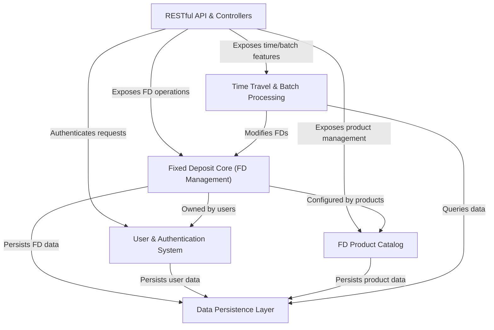

# Tutorial: cashcached_final_integrated_repo

This project, CashCached, is a **banking simulator** focused on *Fixed Deposit (FD)* accounts. It allows users to **create and manage their FDs**, calculates maturity amounts, and provides different *FD product options* with varying terms and rates. Administrators can leverage unique features like **Time Travel** to simulate future dates and *batch process* FD maturities automatically, all accessible via a **RESTful API**.

## Visual Overview

## Chapters

1. [FD Product Catalog
](01_fd_product_catalog_.md)
2. [User & Authentication System
](02_user___authentication_system_.md)
3. [Fixed Deposit Core (FD Management)
](03_fixed_deposit_core__fd_management__.md)
4. [Time Travel & Batch Processing
](04_time_travel___batch_processing_.md)
5. [RESTful API & Controllers
](05_restful_api___controllers_.md)
6. [Data Persistence Layer
](06_data_persistence_layer_.md)

---
